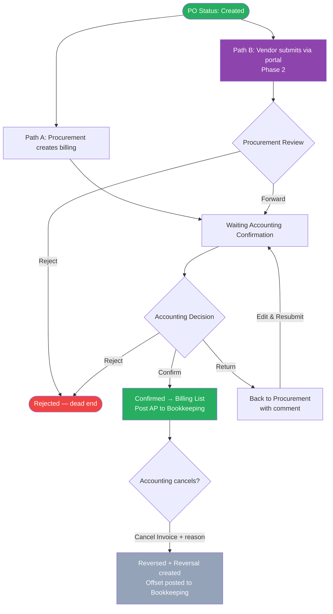

# Feature: Billing Creation and Confirmation

## Module
Billing

## Status
Built (inside PO page) — enhancements planned (see below)

## What Is Already Built
- Billing recording inside the PO page: invoice date, amount, attachment, remark
- Partial billing: multiple billing records per PO supported

## What Is Not Yet Built
- Invoice number field (currently missing — required for Thai Revenue Dept. compliance)
- Accounting confirmation flow (Procurement → Accounting → Confirmed): Accounting has no visibility in the system today, all communication is manual via email
- Return flow: Accounting returns billing to Procurement for correction
- Reject flow: permanent cancellation with mandatory comment
- Reversal support: cancel a confirmed billing and post offsetting entry
- Bookkeeping S3 file posting on billing confirmation and reversal
- Standalone Billing module (queue, billing list, document view, line item view, filters)

---

## Overview
After a PO is created, Procurement records billing against it by entering the vendor's invoice details. Billing is independent of GR — both can happen in any order. Partial billing is supported (multiple invoices per PO). Once Accounting confirms, the record moves to the Billing List and an accounting file is uploaded to S3 for Bookkeeping to record. Confirmed invoices can be cancelled by Accounting via a Reversal.

---

## Solution Description

### Two Billing Paths

**Path A — Internal (Procurement-initiated)**
Procurement creates a billing record directly in the system against a PO. It goes straight to Accounting for confirmation — no Procurement review step.

**Path B — Vendor Portal (Phase 2)**
The vendor submits a billing record through the vendor self-service portal. Procurement reviews it first, then forwards to Accounting for confirmation.

---

### Billing Statuses

There are exactly **5 statuses** for a billing record:

| Status | Where shown | Description |
|---|---|---|
| **Waiting Procurement Review** | Queue | External (Path B) only — vendor submitted, waiting for Procurement |
| **Waiting Accounting Confirmation** | Queue | Internal lands here directly; External arrives after Procurement forwards. Also used when Accounting returns an Internal billing — Procurement sees Edit & Resubmit in the detail modal |
| **Rejected** | Queue (hidden by default, filter to show) | Permanently cancelled by Procurement or Accounting — dead end |
| **Confirmed** | Billing List | Accounting confirmed — AP transaction posted to Bookkeeping |
| **Reversed** | Billing List | Original invoice that was cancelled — offset by a Reversal record |
| **Reversal** | Billing List | Counter-entry that zeroes out the Reversed invoice — shown with negative amounts in red |

**Return is an action, not a status.** When Accounting returns an Internal billing, the status stays **Waiting Accounting Confirmation**. The detail modal detects a return by the presence of Accounting's return comment and shows the Procurement user an "Edit & Resubmit" button instead of read-only view.

**Queue default view:** shows Waiting Procurement Review + Waiting Accounting Confirmation only. Rejected records are hidden by default — user must filter by Status to see them.

**Billing List:** shows Confirmed + Reversed + Reversal records. Filterable by Status and VAT Rate.

---

### Cancellation / Reversal

After a billing is Confirmed, Accounting can cancel it:
- Accounting clicks **Cancel Invoice** on the confirmed record's detail modal
- A cancellation modal appears showing invoice details + warning that this cannot be undone
- Accounting must enter a mandatory reason (minimum 5 characters)
- On confirm: original record status → **Reversed**; a new **Reversal** counter-record is created with the same invoice number + "-R" suffix and negative amounts
- Reversal is posted to Bookkeeping to offset the original AP entry

**Authority:** Accounting only. No second approval required. Reason is mandatory for audit trail.

This is not a credit note. Credit note = partial price adjustment. Reversal = full cancellation of the AP liability.

---

### Return (Accounting → Procurement)

Return is an action, not a status. Accounting returns an **Internal** billing to Procurement with a mandatory comment. Procurement edits and resubmits → status resets to Waiting Accounting Confirmation. Does not restart the Procurement review step.

**Return to vendor portal is not supported in Phase 1.** Incorrect external submissions must be rejected. Vendor submits a new invoice.

---

### Actions by Role and Path

| Situation | Who | Available Actions | Where |
|---|---|---|---|
| Waiting Procurement Review (External) | Procurement | Forward to Accounting · Reject (mandatory comment) | Queue detail modal |
| Waiting Accounting Confirmation | Accounting | Confirm · Return to Procurement (Internal only, mandatory comment) · Reject (mandatory comment) | Queue detail modal |
| Waiting Accounting Confirmation + return comment (Internal) | Procurement | Edit & Resubmit → back to Waiting Accounting Confirmation | Queue detail modal |
| Confirmed | Accounting | Cancel Invoice → triggers Reversal flow | Billing List detail modal |
| Any status | Procurement / Accounting | View details (read-only) | Queue / Billing List detail modal |

Actions are surfaced in the **detail modal** based on the record's status and source — there is no separate Accounting page.

---

### Billing Form Fields (Create Billing modal)

The form is a 3-step flow: **Step 1 — Select PO → Step 2 — Invoice Details → Step 3 — Documents**

| Field | Who fills | Required | Notes |
|---|---|---|---|
| PO selection | User | Yes | Search by PR number, PO number, or vendor name |
| Invoice Number | User | Yes | Must be unique per Vendor across all POs (Thai Revenue Dept. requirement) |
| Invoice Date | User | Yes | Date printed on vendor's tax invoice |
| Line items | User | Yes | Checkbox-select which PO line items are included in this invoice |
| Net Amount (per line) | User | Yes | Amount before VAT — entered by user from vendor's invoice |
| VAT Amount | System | — | Auto-calculated: Net × VAT Rate. Shown to 2 decimal places. Not editable |
| Invoice Total | System | — | Net Amount + VAT Amount. Shown to 2 decimal places |
| Invoice Document | User | Yes | PDF of vendor's tax invoice |
| Copy of PO | User | Yes | PDF of the Purchase Order |
| Delivery Goods Document | User | No | Delivery note or receipt — optional |
| Remarks | User | No | Free text |

**Amount-driven:** User enters Net Amount in Baht. System calculates VAT and total. No quantity or unit price at billing stage.

**VAT flag:** Inherited from PR price comparison stage — 7% (VAT-registered vendor) or 0% (non-VAT vendor). Not editable at billing.

**Monetary precision:** All amounts displayed to 2 decimal places (e.g. Net = 10.00, VAT 7% = 0.70, Total = 10.70).

**Progress bar (per line):** Shows cumulative billed amount vs PO line amount. Turns red if current billing would exceed the PO line amount.

---

### VAT Rules

- VAT Amount = `Math.round(Net × Rate) / 100` — preserves 2 decimal place precision
- Invoice Total = Net Amount + VAT Amount
- 0% VAT vendors show "—" in the VAT column, not 0.00

---

### Partial Billing

Multiple billing records can be created against a single PO. The system tracks cumulative billed amount per line item. PO Billing Status (shown in PO picker during Create Billing):

| PO Billing Status | Meaning |
|---|---|
| **Not Started** | No billing recorded against this PO |
| **Partial** | Some amount billed, not fully billed |
| **Complete** | Total billed equals PO amount |

---

### Billing Tabs

**Queue (default tab)**

Shows all active billing records. Default filter: Waiting Procurement Review + Waiting Accounting Confirmation. Rejected records hidden by default.

| Column | Notes |
|---|---|
| Invoice No. | |
| PO Number | |
| Vendor | |
| Source | Internal / External badge |
| Requester | Who created / submitted the billing |
| Net Amount | Right-aligned, 2dp |
| Invoice Total | Right-aligned, 2dp |
| Status | Badge |
| Submitted | Date |
| Action | View button |

Queue filters: Status (multi), Source (Internal / External)

**Billing List tab**

Shows Confirmed, Reversed, and Reversal records only. Supports two views:

- **Document View** — one expandable row per invoice, expandable to show line items
- **Line Item View** — flat table, one row per line item

| Column | Notes |
|---|---|
| Invoice Date | |
| Invoice No. | Red text for Reversal records |
| PO Number | |
| Vendor | |
| VAT Rate | 7% / 0% badge |
| Net Amount | Negative + red for Reversal |
| VAT Amt | Negative + red for Reversal; "—" for 0% VAT |
| Invoice Total | Negative + red for Reversal |
| Status | Confirmed (green) / Reversed (grey) / Reversal (red) |
| Action | View button |

Billing List filters: Status (Confirmed / Reversed / Reversal), VAT Rate (7% / 0%)

Reversal rows shown with red-tinted background, negative amounts, and red text.

---

### Bookkeeping Integration

After Accounting confirms, the system posts an AP liability transaction to Bookkeeping. If the send fails, the billing record is saved as Confirmed and flagged for retry.

After a Reversal, the system posts an offsetting transaction to Bookkeeping to zero out the original AP entry.

Transaction payload TBD with Bookkeeping team.

---

## Acceptance Criteria

- **Eligibility:** Billing can only be created against a PO with status = Created. No dependency on GR status.
- **Path A flow:** Procurement submits → Waiting Accounting Confirmation → Accounting confirms → Confirmed → Bookkeeping transaction posted.
- **Path B flow (Phase 2):** Vendor submits → Waiting Procurement Review → Procurement forwards → Waiting Accounting Confirmation → Accounting confirms → Confirmed → Bookkeeping posted.
- **Reject:** Both Procurement (Path B, Waiting Procurement Review) and Accounting can reject. Mandatory comment. Status = Rejected. Dead end.
- **Rejected visibility:** Hidden by default in Queue. User must filter by Status = Rejected to see them.
- **Return (Internal only):** Accounting returns Internal billing with mandatory comment. Procurement edits and resubmits → Waiting Accounting Confirmation.
- **No return to vendor portal in Phase 1.**
- **Mandatory fields:** Invoice Number, Invoice Date, Net Amount per line, Invoice Document (PDF), Copy of PO (PDF).
- **Invoice Number uniqueness:** Unique per Vendor across all POs.
- **VAT auto-calculation:** 2 decimal place precision. Not editable at billing.
- **Partial billing:** Multiple billing records per PO. Progress bar per line shows cumulative billed vs PO amount.
- **Cancellation / Reversal:** Accounting only. Mandatory reason. Creates Reversal counter-record with negative amounts. Posts offsetting transaction to Bookkeeping. Cannot be undone.
- **Billing List statuses:** Confirmed, Reversed, Reversal. Reversal rows show negative amounts in red.
- **Bookkeeping integration:** Confirmed billing triggers AP transaction. Send failure saves record and flags for retry.

---

## Process Flow

---

## Decisions Log

- **Invoice uniqueness:** Unique per Vendor — aligns with Thai Revenue Dept. tax invoice requirements.
- **Due Date:** Removed — out of scope, handled by Bookkeeping.
- **Match Status / GR Status:** Removed — not necessary for billing business process.
- **6 statuses total:** Waiting Procurement Review, Waiting Accounting Confirmation, Rejected, Confirmed, Reversed, Reversal.
- **Return is an action not a status:** Resets to Waiting Accounting Confirmation for Internal path only.
- **No return to vendor portal in Phase 1:** Incorrect external submissions are rejected; vendor resubmits new invoice.
- **Reject is permanent:** Both Procurement and Accounting can reject with mandatory comment.
- **Rejected hidden by default:** User must filter Queue to see rejected records.
- **Reversal ≠ Credit Note:** Credit note = partial discount. Reversal = full cancellation of AP liability. Different concepts.
- **Cancellation authority:** Accounting only. No second approval needed. Mandatory reason for audit trail.
- **Monetary precision:** 2 decimal places throughout. `Math.round(net × rate) / 100` to avoid floating point loss.
- **0% VAT display:** VAT column shows "—" not "0.00" for non-VAT vendors.
- **Queue default filter:** Rejected records hidden — user must filter to see them to reduce noise.

---

## Open Questions

- [ ] **Bookkeeping transaction payload:** Fields and format TBD with Bookkeeping team.
- [ ] **Bookkeeping retry:** Manual retry button or automatic background retry?
- [ ] **Rejected record retention:** How long do Rejected records stay visible in the Queue?

---

## What Is Not Yet in the Prototype

- ~~Accounting role view (own queue)~~ — **resolved**: Confirm / Return / Reject actions are injected directly into the queue detail modal based on record status. No separate Accounting page needed.
- Return flow — Procurement edit & resubmit form
- PO Billing Status column on Billing List
- Invoice Number uniqueness validation on Create form
- Bookkeeping retry flag indicator

---

## Related Features

- [PO Creation and Approval](../../02_features/PO-Purchase-Order/001-po-creation-and-approval.md)
- [GR Recording](../../02_features/GR-Good-Receipt/001-gr-recording.md)
