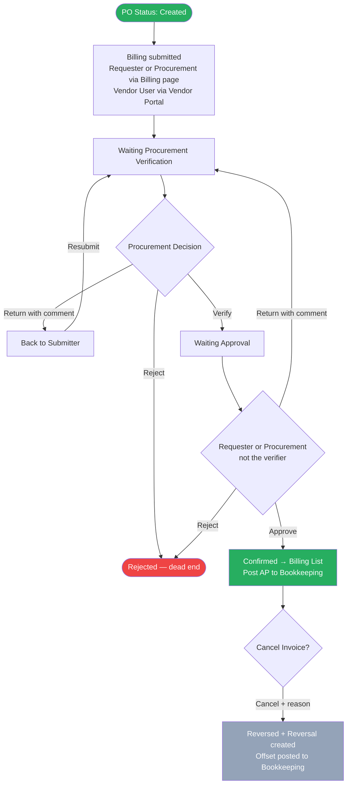

# Feature: Billing Creation and Confirmation

## Module
Billing

## Status
Built (inside PO page) — enhancements planned (see Enhancements section)

## Implementation Status

| # | Feature | Status |
|---|---------|--------|
| — | Billing recording inside PO page: invoice date, amount, attachment, remark | Built |
| — | Partial billing: multiple billing records per PO supported | Built |
| E1 | Create Billing form and Queue page | Pending |
| E2 | Billing List page: Document View and Line Item View | Pending |
| E3 | Approval chain: confirmation, return, and reject flow | Pending |
| E4 | Billing reversal flow | Pending |
| E5 | Bookkeeping integration: S3 file posting on confirmation and reversal | Pending |

## Overview
After a PO is created, the Requester, Procurement team, or Vendor User records billing against it by entering the vendor's invoice details. Billing is independent of GR — both can happen in any order. Partial billing is supported (multiple invoices per PO). Every billing goes through a two-step approval: Procurement verifies, then a Requester or Procurement member (not the same person who verified) approves. Once approved, the record moves to the Billing List and an accounting transaction is posted to Bookkeeping.

## Solution Description

**Who Can Submit Billing**

| Role | Channel |
|---|---|
| Requester (of the PO's PR) | Main Billing page |
| Procurement team member | Main Billing page |
| Vendor User | Vendor Portal only — appears in the Queue after submission |

**Approval Flow — Single Path for All Submitters**

Every billing record, regardless of who submitted it, goes through the same two-step approval:

1. **Procurement Verification** — Any Procurement team member reviews the billing for completeness and accuracy. They can verify (pass to approval), return to the submitter with a mandatory comment, or reject permanently.
2. **Approval** — The Requester of the PO or any Procurement team member approves. **The same person who verified in Step 1 cannot be the approver in Step 2 — the system blocks this.** The approver can approve (→ Confirmed), return to Procurement Verification with a mandatory comment, or reject permanently.

**Billing Statuses**

There are exactly 6 statuses for a billing record:

| Status | Where shown | Description |
|---|---|---|
| Waiting Procurement Verification | Queue | Any billing just submitted — waiting for Procurement to verify |
| Waiting Approval | Queue | Procurement verified — waiting for Requester or Procurement (not the verifier) to approve |
| Rejected | Queue (hidden by default) | Permanently cancelled at any stage — dead end |
| Confirmed | Billing List | Approved — AP transaction posted to Bookkeeping |
| Reversed | Billing List | Original invoice that was cancelled — offset by a Reversal record |
| Reversal | Billing List | Counter-entry that zeroes out the Reversed invoice — shown with negative amounts in red |

Return is an action, not a status:
- Procurement returns during verification → billing goes back to the submitter. Submitter corrects and resubmits → returns to Waiting Procurement Verification.
- Approver returns during approval → billing goes back to Waiting Procurement Verification. Any Procurement member can re-verify.

Queue default view shows Waiting Procurement Verification + Waiting Approval only. Rejected records are hidden by default — user must filter by Status to see them.

**Billing Form Fields**

The form is a 3-step flow: Step 1 — Select PO → Step 2 — Invoice Details → Step 3 — Documents

| Field | Who fills | Required | Notes |
|---|---|---|---|
| PO selection | User | Yes | Search by PR number, PO number, or vendor name |
| Invoice Number | User | Yes | Must be unique per vendor across all POs (Thai Revenue Dept. requirement) |
| Invoice Date | User | Yes | Date printed on vendor's tax invoice |
| Line items | User | Yes | Checkbox-select which PO line items are included in this invoice |
| Net Amount (per line) | User | Yes | Amount before VAT — entered by user from vendor's invoice |
| VAT Amount | System | — | Auto-calculated: Net × VAT Rate. Shown to 2 decimal places. Not editable |
| Invoice Total | System | — | Net Amount + VAT Amount. Shown to 2 decimal places |
| Invoice Document | User | Yes | PDF of vendor's tax invoice |
| Copy of PO | User | Yes | PDF of the Purchase Order |
| Delivery Goods Document | User | No | Delivery note or receipt — optional |
| Remarks | User | No | Free text |

VAT flag is inherited from PR price comparison stage — 7% (VAT-registered vendor) or 0% (non-VAT vendor). Not editable at billing. VAT Amount = `Math.round(Net × Rate) / 100`. 0% VAT vendors show "—" in the VAT column, not 0.00.

A progress bar per line item shows cumulative billed amount vs PO line amount. Turns red if current billing would exceed the PO line amount.

**Billing Adjustment**

When the total billed amount differs from the PO amount by **±1 Baht or less**, the system automatically creates an adjustment transaction to bring the billing to exactly the PO amount.

| Scenario | PO Amount | Billed | Difference | Result |
|---|---|---|---|---|
| Under-billed within ±1 | 100.00 | 99.90 | −0.10 | Auto-adjust +0.10 → final 100.00 |
| Over-billed within ±1 | 100.00 | 100.01 | +0.01 | Auto-adjust −0.01 → final 100.00 |
| Under-billed beyond 1 | 100.00 | 95.00 | −5.00 | Allowed — partial billing, no adjustment |
| Over-billed beyond 1 | 100.00 | 101.50 | +1.50 | **Blocked** — cannot submit |

- Adjustment is system-generated — not entered by the user
- **Bookkeeping receives two separate transactions** under the same group reference: the billed amount and the adjustment. When reversed, both are reversed together as a group.
- **Billing detail modal shows two lines** when an adjustment applies: the billed amount and the adjustment amount separately. Total of both = PO amount. Visible to all roles equally.
- **Over-billing beyond +1 Baht is a hard block** — the Submit button is disabled and an inline error is shown. The user must correct the amount before submitting.
- Under-billing beyond 1 Baht is allowed — treated as partial billing. The PO remains open for additional billings.

---

**Partial Billing**

Multiple billing records can be created against a single PO. PO Billing Status reflects cumulative billed amount:

| PO Billing Status | Meaning |
|---|---|
| Not Started | No billing recorded against this PO |
| Partial | Some amount billed, not fully billed |
| Complete | Total billed equals PO amount |

**Actions by Role**

| Situation | Who | Available Actions |
|---|---|---|
| Waiting Procurement Verification | Any Procurement member | Verify (→ Waiting Approval) · Return to submitter (mandatory comment) · Reject (mandatory comment) |
| Waiting Approval | Requester or Procurement (not the verifier) | Approve (→ Confirmed) · Return to Procurement Verification (mandatory comment) · Reject (mandatory comment) |
| Confirmed | Requester or Procurement | Cancel Invoice → triggers Reversal flow |
| Any status | All roles | View details (read-only) |

**Billing Reversal**

After a billing is Confirmed, an authorized user can cancel it:
- Clicks **Cancel Invoice** on the confirmed record's detail modal
- A cancellation modal shows invoice details + warning that this cannot be undone
- Mandatory reason required (minimum 5 characters)
- On confirm: original record status → Reversed; a new Reversal counter-record is created with the same invoice number + "-R" suffix and negative amounts
- Reversal invoice date is system-set to the same date as the original invoice — not editable
- Reversal is posted to Bookkeeping to offset the original AP entry

Authority: Requester of the PO's PR or any Procurement team member. No second approval required. Mandatory reason for audit trail. This is not a credit note — Reversal = full cancellation of the AP liability.

**Queue Tab**

Shows all active billing records. Default filter: Waiting Procurement Review + Waiting Accounting Confirmation. Rejected records hidden by default.

| Column | Notes |
|---|---|
| Invoice No. | |
| PO Number | |
| Vendor | |
| Source | Internal / External badge |
| Requester | Who created / submitted the billing |
| Net Amount | Right-aligned, 2dp |
| Invoice Total | Right-aligned, 2dp |
| Status | Badge |
| Submitted | Date |
| Action | View button |

Queue filters: Status (multi-select), Source (Internal / External)

**Billing List Tab**

Shows Confirmed, Reversed, and Reversal records only. Supports Document View and Line Item View.

Document View — one expandable row per invoice:

| Invoice Date | Invoice No. | PO Number | Vendor | VAT Rate | Net Amount | VAT Amt | Invoice Total | Status | Action |
|---|---|---|---|---|---|---|---|---|---|
| 2026-06-01 | INV-0001 | PO-0042 | ABC Co. | 7% | 100,000 | 7,000 | 107,000 | Confirmed | View |
| 2026-06-03 | INV-0002 | PO-0038 | XYZ Co. | 0% | 50,000 | — | 50,000 | Reversed | View |
| 2026-06-03 | INV-0002-R | PO-0038 | XYZ Co. | 0% | -50,000 | — | -50,000 | Reversal | View |

> Reversal invoice date is system-set to the same date as the original invoice — not editable.

Line Item View — one flat row per line item. Reversal rows show negative amounts in red.

Billing List filters: Status (Confirmed / Reversed / Reversal), VAT Rate (7% / 0%)

**Bookkeeping Integration**

After Accounting confirms, the system posts an AP liability transaction to Bookkeeping. After a Reversal, the system posts an offsetting transaction to zero out the original AP entry. If the send fails, the billing record is saved and flagged for retry. Transaction payload TBD with Bookkeeping team.

## Acceptance Criteria
- **Eligibility:** Billing can only be created against a PO with status = Created. No dependency on GR status.
- **Who can submit:** Requester of the PO's PR or any Procurement team member via the Billing page. Vendor Users submit via the Vendor Portal — their billings appear in the Queue automatically.
- **Approval flow:** Any billing submitted (by any role) → Waiting Procurement Verification → Procurement verifies → Waiting Approval → Requester or Procurement (not the verifier) approves → Confirmed → Bookkeeping transaction posted.
- **Verifier ≠ Approver:** The system blocks the same person who verified from being the approver. Other Procurement members and the Requester can still approve.
- **Return — Procurement to submitter:** Procurement can return the billing to the submitter with a mandatory comment during verification. Submitter corrects and resubmits → returns to Waiting Procurement Verification.
- **Return — Approver to Procurement:** The approver can return the billing to Procurement Verification with a mandatory comment. Any Procurement member can re-verify.
- **Reject:** Procurement (during verification) and the approver (during approval) can reject with a mandatory comment. Status = Rejected. Dead end.
- **Rejected visibility:** Hidden by default in Queue. User must filter by Status = Rejected to see them.
- **Mandatory fields:** Invoice Number, Invoice Date, Net Amount per line, Invoice Document (PDF), Copy of PO (PDF).
- **Invoice Number uniqueness:** Unique per vendor across all POs.
- **VAT auto-calculation:** VAT Amount = Net × VAT Rate, 2 decimal place precision. Not editable at billing. 0% VAT shows "—" not "0.00".
- **Partial billing:** Multiple billing records per PO. Progress bar per line shows cumulative billed vs PO line amount. Turns red if billing would exceed PO line amount.
- **Billing adjustment:** If the billed amount is within ±1 Baht of the PO amount, the system auto-generates an adjustment to bring the total to exactly the PO amount. Bookkeeping receives two transactions under the same group reference (billed + adjustment). The billing detail modal shows both as separate lines for all roles. Over-billing beyond +1 Baht is a hard block — Submit is disabled. Under-billing beyond 1 Baht is allowed as partial billing. On reversal, both transactions are reversed together as a group.
- **Billing Reversal:** Requester or Procurement only. Mandatory reason (≥5 characters). Creates Reversal counter-record with negative amounts dated same as original invoice date (system-set, not editable). Posts offsetting transaction to Bookkeeping. Cannot be undone.
- **Billing List statuses:** Confirmed, Reversed, Reversal. Reversal rows show negative amounts in red with red-tinted background.
- **Bookkeeping integration:** Confirmed billing triggers AP transaction. Send failure saves record and flags for retry.

## Process Flow

## Enhancements

### Context
The current flow records billing inside the PO page with no invoice number, no approval chain, and no Bookkeeping integration. E1–E5 build billing as a standalone module with a proper Create Billing form, Queue, Billing List, approval chain, reversal flow, and Bookkeeping integration.

---

### E1 — Create Billing Form and Queue Page

**Status:** Pending

Replaces billing recording inside the PO page with a dedicated Billing page accessible from main navigation. Includes a Create Billing 3-step modal and a Queue page showing active billing records awaiting action.

**Acceptance Criteria:**

*Create Billing — 3-step modal*
- "+ Create Billing" button is available to Requester and Procurement only. Vendor Users do not have access to this page — they submit via the Vendor Portal.
- Step 1 — Select PO: user searches by PR number, PO number, or vendor name. Live dropdown appears when at least one character is typed.
- Step 2 — Invoice Details: user fills in invoice information. Mandatory fields: Invoice Number, Invoice Date, at least one line item selected, Net Amount per selected line item.
- Step 3 — Documents: user uploads supporting files. Mandatory: Invoice Document (PDF), Copy of PO (PDF). Optional: Delivery Goods Document, Remarks.
- Submit button is disabled until all mandatory fields are filled and mandatory files are uploaded.

*Create Billing — form fields*

| Field | Required | Notes |
|---|---|---|
| PO selection | Yes | Search by PR number, PO number, or vendor name |
| Invoice Number | Yes | Must be unique per vendor across all POs (Thai Revenue Dept. requirement). Duplicate blocked with inline error. |
| Invoice Date | Yes | Date printed on vendor's tax invoice |
| Line items | Yes | Checkbox-select which PO line items are included. At least one required. |
| Net Amount (per line) | Yes | Amount before VAT — entered by user from vendor's invoice |
| VAT Amount | Auto | Calculated: Net × VAT Rate. 2 decimal places. Not editable. |
| Invoice Total | Auto | Net Amount + VAT Amount. 2 decimal places. |
| Invoice Document | Yes | PDF of vendor's tax invoice |
| Copy of PO | Yes | PDF of the Purchase Order |
| Delivery Goods Document | No | Delivery note or receipt |
| Remarks | No | Free text |

- VAT rate is inherited from PR price comparison — 7% or 0%. Not editable at billing.
- A progress bar per line item shows cumulative billed amount vs PO line amount. Turns red if billing would exceed the PO line amount.
- If the billed amount exceeds the PO amount by more than 1 Baht, submission is hard-blocked — Submit button is disabled and an inline error is shown.
- If the billed amount differs from the PO amount by ±1 Baht or less, the system auto-generates an adjustment transaction to bring the total to exactly the PO amount. The adjustment is included in the Bookkeeping transaction and is not visible or editable by the user.
- Under-billing beyond 1 Baht is allowed — treated as partial billing, no adjustment generated.

*Queue page*
- Default view shows Waiting Procurement Review and Waiting Accounting Confirmation records only.
- Rejected records are hidden by default — user must filter by Status = Rejected to see them.
- Columns: Invoice No., PO Number, Vendor, Source (Internal / External), Requester, Net Amount, Invoice Total, Status, Submitted date, View action.
- Filters: Status (multi-select), Source (Internal / External).

---

### E2 — Billing List Page

**Status:** Pending

Dedicated Billing List page showing all Confirmed, Reversed, and Reversal records with Document View and Line Item View.

**Acceptance Criteria:**

- Shows Confirmed, Reversed, and Reversal records only.
- Filters: Status (Confirmed / Reversed / Reversal), VAT Rate (7% / 0%).

Document View — one expandable row per invoice:

| Invoice Date | Invoice No. | PO Number | Vendor | VAT Rate | Net Amount | VAT Amt | Invoice Total | Status | Action |
|---|---|---|---|---|---|---|---|---|---|
| 2026-06-01 | INV-0001 | PO-0042 | ABC Co. | 7% | 100,000 | 7,000 | 107,000 | Confirmed | View |
| 2026-06-03 | INV-0002 | PO-0038 | XYZ Co. | 0% | 50,000 | — | 50,000 | Reversed | View |
| 2026-06-03 | INV-0002-R | PO-0038 | XYZ Co. | 0% | -50,000 | — | -50,000 | Reversal | View |

> Reversal invoice date is system-set to the same date as the original invoice — not editable.

Each row expands to show line items. Reversal rows show negative amounts in red with red-tinted background.

Line Item View — one flat row per line item across all invoices. Reversal rows appear in date order with negative amounts.

---

### E3 — Approval Chain

**Status:** Pending

Adds a two-step approval chain: Procurement Verification → Approval by Requester or Procurement (not the verifier). Replaces free-form billing recording with a structured, role-enforced flow.

**Acceptance Criteria:**

*Step 1 — Procurement Verification*
- All submitted billings (from any submitter) land at Waiting Procurement Verification.
- Any Procurement team member can verify the billing — status moves to Waiting Approval.
- Procurement can return the billing to the submitter with a mandatory comment. Submitter corrects and resubmits → returns to Waiting Procurement Verification.
- Procurement can reject with a mandatory comment — status = Rejected. Dead end.

*Step 2 — Approval*
- The Requester of the PO or any Procurement team member can approve.
- The system blocks the same person who verified in Step 1 from being the approver. The Approve button is disabled for that person.
- Approver can approve → status moves to Confirmed and Bookkeeping transaction is posted.
- Approver can return with a mandatory comment → billing goes back to Waiting Procurement Verification. Any Procurement member can re-verify.
- Approver can reject with a mandatory comment → status = Rejected. Dead end.

*Reject*
- Rejected status is permanent — no further actions available.
- Rejected records are hidden by default in the Queue. User must filter by Status = Rejected to see them.

---

### E4 — Billing Reversal Flow

**Status:** Pending

Allows Accounting to cancel a Confirmed billing by creating a Reversal counter-record with negative amounts. Procurement cannot trigger a reversal — this is Accounting authority only.

**Acceptance Criteria:**

- "Cancel Invoice" button is available only on Confirmed records in the Billing List, visible to Accounting only. Procurement cannot reverse a billing.
- Accounting must enter a mandatory cancellation reason (≥5 characters). Cannot be undone.
- On confirm: original record status → Reversed; a Reversal counter-record is created with the same invoice number + "-R" suffix and negative amounts.
- Reversal record invoice date is system-set to the same date as the original invoice — not editable.
- Reversal counter-record appears in the Billing List in date order — not nested under the original.

---

### E5 — Bookkeeping Integration

**Status:** Pending

Posts accounting transactions to Bookkeeping on both billing confirmation and reversal. Failed posts are flagged for retry without blocking the billing record.

**Acceptance Criteria:**

- Every Confirmed billing triggers an AP liability transaction to Bookkeeping immediately after confirmation.
- Every Billing Reversal triggers an offsetting transaction to Bookkeeping to zero out the original AP entry.
- If the Bookkeeping post fails, the billing record is still saved. The failed record is flagged internally for retry.
- Transaction payload format to be defined with the Bookkeeping team (TBD).

---

## Decisions Log
- **Invoice uniqueness** — ✅ Unique per vendor — aligns with Thai Revenue Dept. tax invoice requirements.
- **Single approval path** — ✅ All submitters (Requester, Procurement, Vendor User) follow the same flow: Procurement Verification → Approval. No separate internal/external paths.
- **Verifier ≠ Approver (same person)** — ✅ System blocks the person who verified from being the approver to prevent self-approval. Other Procurement members and Requesters can still approve.
- **Return is an action not a status** — ✅ Returning goes back to a previous step without creating a new status. Waiting Procurement Verification and Waiting Approval are the only active queue statuses.
- **Reject is permanent** — ✅ Both Procurement (at verification) and the approver can reject with mandatory comment.
- **Rejected hidden by default** — ✅ Reduces noise in Queue. User must filter to see them.
- **Reversal ≠ Credit Note** — ✅ Credit note = partial discount. Reversal = full cancellation of AP liability.
- **Reversal date = original invoice date** — ✅ System-set, not editable, so the offsetting transaction posts to the correct period.
- **Reversal authority** — ✅ Requester of the PO's PR or any Procurement team member. No second approval required.
- **Monetary precision** — ✅ 2 decimal places throughout. `Math.round(net × rate) / 100` to avoid floating point loss.
- **0% VAT display** — ✅ VAT column shows "—" not "0.00" for non-VAT vendors.
- **Billing adjustment tolerance** — ✅ ±1 Baht. Within tolerance: auto-adjustment to PO amount. Bookkeeping receives two transactions (billed + adjustment) under the same group reference. Billing detail shows both lines to all roles. On reversal, both are reversed as a group. Over-billed beyond +1: hard block. Under-billed beyond 1: allowed as partial billing.
- **Due Date** — ✅ Out of scope — handled by Bookkeeping.

## Open Questions
- [ ] **Bookkeeping transaction payload:** Fields and format TBD with Bookkeeping team.
- [ ] **Bookkeeping retry:** Manual retry button or automatic background retry?
- [ ] **Rejected record retention:** How long do Rejected records stay visible in the Queue?

## Related Features
- [PO Creation and Approval](../../02_features/PO-Purchase-Order/001-po-creation-and-approval.md)
- [GR Recording](../../02_features/GR-Good-Receipt/001-gr-recording.md)
- [Vendor Portal Billing](002-vendor-portal-billing.md)
