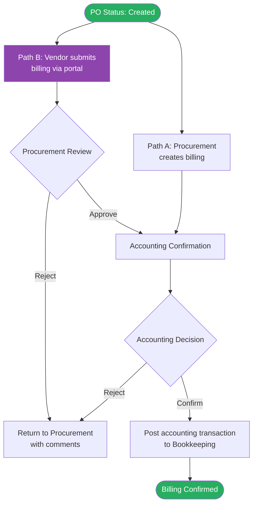

# Feature: Billing Creation and Confirmation

## Module
Billing

## Status
Draft

## Overview
After a PO is Created, billing can be recorded against it in two ways: internally by Procurement, or submitted by the vendor through a self-service portal (Phase 2). Both paths go through Accounting confirmation before the accounting transaction is sent to Bookkeeping. Billing is independent of GR — both can happen in any order. Partial billing is supported.

## Solution Description

### Two Billing Paths

**Path A — Internal (Procurement-initiated)**
Procurement creates a billing record directly in the system against a PO and submits it to Accounting for confirmation.

**Path B — Vendor Portal (Phase 2)**
The vendor submits a billing record through the vendor self-service portal. Procurement reviews it first, then forwards to Accounting for confirmation.

Both paths share the same Accounting confirmation step. Rejection at any step returns the billing record to Procurement — not to the vendor.

---

### Billing Form Fields

When creating a billing record, the following fields are captured:

| Field | Who fills | Notes |
|---|---|---|
| Invoice Number | User | From vendor's invoice — must be unique per PO |
| Invoice Date | User | Date printed on vendor's invoice |
| Due Date | User | Payment due date |
| Line items billed | User | Select which PO line items are included; enter qty and confirm unit price |
| Net Amount | User | Amount before VAT, from vendor's invoice |
| VAT | System | Auto-calculated based on VAT flag set by Procurement during price comparison |
| Invoice Total | System | Net Amount + VAT — sent to Bookkeeping as AP liability |
| Invoice Document | User | PDF of vendor's tax invoice — mandatory |
| Copy of PO | User | PDF of the Purchase Order — mandatory |
| Delivery Goods Document | User | Delivery note / receipt from the vendor — optional |
| Remarks | User | Optional free text |

**VAT flag:** Set by Procurement during price comparison in the PR stage when they record the vendor's quote. Carries through to the PO and billing. Two values: 7% (VAT-registered vendor) or 0% (non-VAT vendor). Payment and WHT are out of scope — handled by Bookkeeping when processing payment.

---

### VAT Rules

The VAT flag is set by Procurement at price comparison and flows to billing automatically. The user only enters the **Net Amount** — Invoice Total is calculated by the system.

**Formula:**
- VAT Amount = Net Amount × VAT Rate (7% or 0%)
- Invoice Total = Net Amount + VAT Amount

**Use Cases — user enters Net Amount = 100:**

*Case 1: VAT vendor (7%)*
| Field | Amount |
|---|---|
| Net Amount | 100.00 |
| VAT 7% | +7.00 |
| **Invoice Total** | **107.00** |

*Case 2: Non-VAT vendor (0%)*
| Field | Amount |
|---|---|
| Net Amount | 100.00 |
| VAT 0% | +0.00 |
| **Invoice Total** | **100.00** |

---

### Approval Flow

**Path A (Internal):** Procurement submits → Accounting confirms → Bookkeeping transaction posted

**Path B (Vendor Portal):** Vendor submits → Procurement reviews → Accounting confirms → Bookkeeping transaction posted

Rejection at any step returns the billing record to **Procurement** with comments. Procurement can edit and resubmit or return it further.

---

### Partial Billing

Multiple billing records can be created against a single PO. The system tracks cumulative billed amount and flags when fully billed. PO Billing Status:
- **Not Started** — no billing recorded
- **Partial** — some amount billed, not fully billed
- **Complete** — total billed equals PO total

---

### Bookkeeping Integration

After Accounting confirms, the system posts an accounting transaction to Bookkeeping. If the send fails, the billing record is saved and flagged for retry. Transaction payload TBD with Bookkeeping team.

---

### Billing Tabs

The billing section has three views toggled by the user:

**Queue (default) — billing records in workflow**

Procurement sees all records in flight:

| Invoice No. | PO Number | Vendor | Net Amount | Total Payable | Status | Date Submitted |
|---|---|---|---|---|---|---|
| INV-2024-001 | PO-0038 | XYZ Co. | 50,000 | 53,500 | Waiting Procurement Review | 2026-06-03 |
| INV-2024-002 | PO-0042 | ABC Co. | 145,000 | 154,150 | Waiting Accounting Confirmation | 2026-06-04 |

Accounting sees only records waiting for their action:

| Invoice No. | PO Number | Vendor | Net Amount | Total Payable | Status | Date Submitted |
|---|---|---|---|---|---|---|
| INV-2024-002 | PO-0042 | ABC Co. | 145,000 | 154,150 | Waiting Accounting Confirmation | 2026-06-04 |

Queue filters: PO Number, Vendor, Status, Date range

---

**Billing List — Document View (confirmed records only)**

One row per billing record, expandable to see line items.

Collapsed columns:

| Invoice Date | Invoice No. | PO Number | Vendor | Net Amount | VAT | Invoice Total | |
|---|---|---|---|---|---|---|---|
| 2026-06-01 | INV-2024-003 | PO-0035 | DEF Co. | 80,000 | 5,600 | 85,600 | ▶ |

Expanded sub-row columns:

| Item Name | Qty Billed | Unit Price | Amount |
|---|---|---|---|
| Laptop Dell | 2 | 35,000 | 70,000 |
| HDMI Cable | 20 | 500 | 10,000 |

---

**Billing List — Line Item View (confirmed records only)**

One row per billed line item. Flat list for reconciliation.

| Invoice Date | Invoice No. | PO Number | Vendor | Item Name | Qty | Unit Price | Net Amount | VAT | Invoice Total |
|---|---|---|---|---|---|---|---|---|---|
| 2026-06-01 | INV-2024-003 | PO-0035 | DEF Co. | Laptop Dell | 2 | 35,000 | 70,000 | 4,900 | 74,900 |
| 2026-06-01 | INV-2024-003 | PO-0035 | DEF Co. | HDMI Cable | 20 | 500 | 10,000 | 700 | 10,700 |

Billing List filters:

| Filter | Values |
|---|---|
| Invoice Date | Date range picker |
| Invoice Number | Text search |
| PO Number | Text search |
| Vendor | Dropdown / search |
| Amount | Min–Max range |

---

## Acceptance Criteria
- **Eligibility:** Billing can only be created against a PO with status = Created. No dependency on GR status.
- **Billing form:** Invoice Number, Invoice Date, Due Date, line items, Net Amount, Invoice Document (PDF), and Copy of PO (PDF) are mandatory. Delivery Goods Document is optional.
- **VAT auto-calculation:** System reads VAT flag set by Procurement at price comparison stage and calculates VAT (7% or 0%) automatically. Not editable by user at billing stage.
- **Invoice Total:** System calculates Net Amount + VAT. This is the AP liability sent to Bookkeeping. Payment and WHT are out of scope — handled by Bookkeeping.
- **Path A:** Procurement submits → Accounting confirms → Bookkeeping transaction posted.
- **Path B (Phase 2):** Vendor submits via portal → Procurement reviews → Accounting confirms → Bookkeeping transaction posted.
- **Rejection handling:** Rejection at any step returns the billing record to Procurement with comments. Vendor is not notified directly.
- **Partial billing:** Multiple billing records per PO allowed. System tracks cumulative billed amount. PO Billing Status: Not Started / Partial / Complete.
- **Bookkeeping integration:** Confirmed billing triggers accounting transaction to Bookkeeping. Send failure saves the record and flags for retry.
- **Queue visibility:** Procurement sees all pending billing records. Accounting sees only records waiting for their confirmation.
- **Billing List:** Shows confirmed records only. Supports Document View (expandable) and Line Item View (flat).
- **Billing List visibility:** Procurement and Accounting team.

## Process Flow

## Open Questions
- [ ] **Bookkeeping transaction payload:** Fields and format to be defined with Bookkeeping team. Minimum: Net Amount, VAT Amount, Invoice Total (AP liability), PO reference, vendor.
- [ ] **Bookkeeping retry:** Manual retry button or automatic background retry for failed sends?
- [ ] **Queue — Procurement sees all:** Should Procurement also see their own Path A submissions in the queue (for tracking), or only Path B vendor submissions pending review?

## Related Features
- [PO Creation and Approval](../../02_features/PO-Purchase-Order/001-po-creation-and-approval.md)
- [GR Recording](../../02_features/GR-Good-Receipt/001-gr-recording.md)
