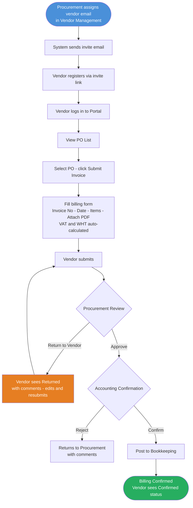

# Feature: Vendor Portal — Billing Submission

## Module
Billing

## Status
Phase 2

## Overview
The vendor portal is a self-service web portal where approved vendors can view all their POs, track transaction history, submit invoices against a PO, and monitor billing status in real time. This replaces email and phone-based invoice submission and reduces back-and-forth between vendors and the Procurement / Accounting team.

## Solution Description

### Vendor Access and Authentication

Vendor access is invite-only — tied directly to the Vendor master in Vendor Management.

**Onboarding flow:**
1. Procurement assigns a contact email to the vendor record in Vendor Management
2. Procurement triggers an invite from the system
3. System sends an invite email to that address with a registration link (link expires in 7 days)
4. Vendor clicks the link, sets a password, and gains access to the portal
5. The portal account is permanently linked to the vendor's master record — VAT status and WHT rate load automatically from it

Only the email registered in Vendor master can access the portal. Vendors cannot self-register without an invite.

---

### Portal Pages

**1. Dashboard**
Summary view shown on login:
- Open POs count and total value
- Pending invoices count (submitted, not yet confirmed)
- Confirmed invoices count (this month)
- Recent activity feed (last 5 actions)

---

**2. PO List**
All Purchase Orders issued to this vendor. Read-only — vendor cannot edit PO content.

| PO Number | PO Date | Items | PO Amount | GR Status | Billing Status | Action |
|---|---|---|---|---|---|---|
| PO-0042 | 2026-05-10 | 3 items | 145,000 | Partially Received | Not Started | Submit Invoice |
| PO-0038 | 2026-05-20 | 1 item | 12,500 | Fully Received | Complete | — |

Columns:
- **PO Number** — clickable, opens PO detail page
- **PO Date** — date PO was created
- **Items** — number of line items
- **PO Amount** — total PO value
- **GR Status** — Not Started / Partially Received / Fully Received (read-only, from GR records)
- **Billing Status** — Not Started / Partial / Complete (from confirmed billings only)
- **Action** — Submit Invoice button; hidden when Billing Status is Complete

PO detail page shows:
- PO header (vendor, date, total)
- Line items (item name, qty, unit price, amount)
- GR history (date, qty received per item) — read-only
- Billing history (invoices submitted and their status)

---

**3. Submit Invoice**
Vendor submits an invoice against a selected PO. The form pre-fills from the PO to reduce manual entry.

| Field | Source | Notes |
|---|---|---|
| PO Number | Pre-filled | From selected PO |
| Vendor Name | Pre-filled | From Vendor master |
| Invoice Number | Vendor enters | Must be unique |
| Invoice Date | Vendor enters | Date on vendor's invoice |
| Due Date | Vendor enters | Requested payment date |
| Line items to bill | Vendor selects | Select which PO items; enter qty being billed |
| Net Amount | Vendor enters | Amount before VAT, from their invoice |
| VAT | System calculates | Based on VAT flag set by Procurement at price comparison — 7% or 0% |
| Invoice Total | System calculates | Net Amount + VAT — read-only |
| Invoice Document | Vendor uploads | PDF of vendor's tax invoice — **mandatory** |
| Copy of PO | Vendor uploads | PDF of the Purchase Order issued by Ngern Turbo — **mandatory** |
| Delivery Goods Document | Vendor uploads | Delivery note / receipt from the vendor — optional |
| Remarks | Vendor enters | Optional free text |

**VAT use cases — vendor enters net amount 100:**

| Case | Net Amount | VAT | Invoice Total |
|---|---|---|---|
| VAT vendor (7%) | 100.00 | +7.00 | 107.00 |
| Non-VAT vendor (0%) | 100.00 | +0.00 | 100.00 |

VAT is read-only on the form — set by Procurement at price comparison and not editable by the vendor. Payment and WHT are out of scope for this system — handled by Bookkeeping when processing payment.

Once submitted, the invoice enters the Procurement review queue.

---

**4. My Invoices**
Full history of all invoices submitted by this vendor. Vendor tracks status here without contacting Procurement.

| Invoice No. | Invoice Date | PO Number | Net Amount | Invoice Total | Status | Action |
|---|---|---|---|---|---|---|
| INV-2024-001 | 2026-06-01 | PO-0042 | 80,000 | 85,600 | Confirmed | — |
| INV-2024-002 | 2026-06-03 | PO-0038 | 50,000 | 50,000 | Waiting Review | — |
| INV-2024-003 | 2026-06-04 | PO-0042 | 30,000 | 32,100 | Returned | Edit and Resubmit |

**Invoice status values:**

| Status | Meaning |
|---|---|
| Waiting Review | Submitted — Procurement has not yet reviewed |
| Waiting Confirmation | Procurement approved — Accounting is reviewing |
| Returned | Procurement returned to vendor with comments — vendor must edit and resubmit |
| Confirmed | Accounting confirmed — billing is posted to Bookkeeping |

When status is **Returned**, the vendor sees Procurement's comments and can click **Edit and Resubmit** to correct and resubmit.

---

### Approval Flow

1. Vendor submits invoice → enters **Procurement Review queue**
2. Procurement reviews:
   - **Approve** → moves to Accounting Confirmation queue
   - **Return to Vendor** → vendor sees Returned status with mandatory comments; can edit and resubmit
3. Accounting confirms:
   - **Confirm** → Bookkeeping transaction posted; vendor sees Confirmed
   - **Reject** → returns to Procurement (not to vendor); Procurement resolves internally

---

### Notifications

Vendor receives an email notification when:
- Invoice is submitted successfully
- Invoice is Returned by Procurement (with comments)
- Invoice is Confirmed by Accounting

---

## Acceptance Criteria
- **Access:** Vendor can only access the portal via an invite sent to the email in Vendor master. No self-registration without invite.
- **Invite:** Invite link expires in 7 days. Procurement can resend if expired.
- **VAT:** Set by Procurement at price comparison stage — 7% or 0%. Read-only for vendor. Not editable on billing form.
- **PO List:** Vendor sees only POs issued to them. PO content is read-only.
- **GR Status on PO:** Vendor can see GR status (Not Started / Partially Received / Fully Received) to know when to bill.
- **Billing Status on PO:** Derived from confirmed billings only. Pending invoices do not count toward Billing Status.
- **Invoice submission:** Invoice Number, Invoice Date, Due Date, at least one line item, Invoice Document (PDF), and Copy of PO (PDF) are mandatory. Delivery Goods Document is optional.
- **Partial billing:** Vendor can submit invoice for a subset of PO line items or partial quantity.
- **Return to Vendor:** Procurement can return an invoice to the vendor with mandatory comments. Vendor sees Returned status and can edit and resubmit.
- **Accounting rejection:** Returns to Procurement, not to vendor. Vendor status remains Waiting Confirmation until Procurement resolves.
- **My Invoices:** Vendor tracks all submitted invoices and their current status without contacting Procurement.
- **Notifications:** Vendor receives email on submission confirmed, returned, and confirmed.
- **Audit trail:** Every action (submit, return, approve, confirm) is timestamped and recorded.

## Process Flow
Reference: [vendor-portal-billing.md](../../04_diagrams/process-flows/vendor-portal-billing.md)

## Open Questions
- [ ] **Multiple contacts per vendor** — can one vendor have more than one portal user (e.g., finance contact + sales contact)? Or strictly one login per vendor?
- [ ] **WHT certificate** — vendors in Thailand expect a WHT certificate (ใบรับรองหักภาษี ณ ที่จ่าย) after Bookkeeping processes payment. Out of scope for this system — consider whether Bookkeeping generates it or this portal delivers it in a future phase.
- [ ] **Non-PO invoices** — can vendors submit invoices not against a PO (e.g., contract-based work)? Or PO-based only?
- [ ] **Invite resend** — can any Procurement user resend the invite, or only the one who created the vendor record?

## Related Features
- [Billing Creation and Confirmation](001-billing-creation.md)
- [PO Creation and Approval](../../02_features/PO-Purchase-Order/001-po-creation-and-approval.md)
