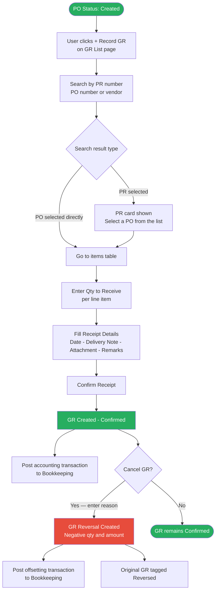

# Feature: Good Receipt Recording

## Module
GR — Good Receipt

## Status
Built (inside PO page) — enhancements planned (see below)

## What Is Already Built
- GR recording inside the PO page: quantity received, GR date, remark, attachment
- Partial receipt: multiple GRs per PO supported

## What Is Not Yet Built
- Delivery note number field
- Reversal and Reversal transaction types (GR is currently final with no cancellation mechanism)
- Bookkeeping S3 file posting on GR confirmation and reversal
- Standalone GR module (list page, document view, line item view, filters, export)

## Overview
After a PO is Created, the requester or Procurement team records that goods or services have been received against that PO. Receipts can be partial or full. Each confirmed GR generates an accounting file uploaded to S3 for Bookkeeping to record. GR records are immutable — corrections are handled through a GR Reversal document.

## Solution Description

### GR Entry Point

GR is recorded from the **GR List page** via the **"+ Record GR"** button in the toolbar. Clicking it opens the Record GR modal. Users do not record GR from the PO page directly.

---

### Record GR Modal — 3-Step Flow

**Step 1 — Search**

A single search field lets the user find a PR or PO to receive against. As the user types, a grouped live dropdown appears with two sections:

- **Purchase Requests** — matches by PR number, topic, or requester name. Each result shows the PR number, topic, requester, and remaining units across all its POs.
- **Purchase Orders** — matches by PO number or vendor name. Each result shows the PO number, vendor, linked PR, and remaining units.

The dropdown only opens when the user has typed at least one character. It closes when the input is cleared.

**Behavior by selection type:**

| User clicks | Next step |
|---|---|
| A PR result | PR card appears + list of POs under that PR. User selects a PO. |
| A PO result | Skips the PO list step — goes directly to the items table. |

**Step 2 — PO Selection (only if PR was chosen)**

After selecting a PR, the system shows:
- A gray PR card at the top (PR number + topic + requester) with a ✕ button to go back to search
- A list of POs under that PR, each showing PO number, vendor, date, item count, PO total, and remaining units
- User clicks a PO row or its **Select** button to advance

**Step 3 — Receive Items**

After a PO is selected, the modal shows:
1. A blue PO summary card (PO number, vendor, PO date, PO total) with a ✕ to go back to PO list
2. **Items to Receive** table
3. **Receipt Details** form

---

### Items to Receive Table

GR is recorded by entering a **quantity to receive** per line item. The system calculates the cumulative GR progress as a percentage of the total ordered quantity and displays it as a live progress bar.

| Column | Notes |
|---|---|
| # | Row number |
| Item Name | From PO line item |
| Type | Asset or Expense badge |
| GL / Asset No. | Asset number (free text) or GL code from Finance Coding stage |
| Line Total | Total value of this line item (ordered qty × unit price) — for reference |
| Ordered Qty | Total quantity on the PO line — for reference |
| Remaining Qty | Ordered qty minus all previously confirmed GR quantities. Bold when > 0, muted when 0. |
| Qty to Receive | Numeric input. Cannot exceed Remaining Qty. Error state shown inline. Disabled (shows —) if Remaining Qty = 0. |
| GR Progress | Live progress bar showing cumulative receipt status. Grey segment = already received in prior GRs. Navy segment = this GR (grows as user types). Label shows total % after this GR (e.g. "65% total received after this GR"). Turns red if quantity exceeds remaining. Fully received items show a solid green 100% bar. |

Fully received items are visually dimmed and the input is disabled.

**Live footer totals** (appear once any quantity > 0 is entered):
- Est. Amount (sum of `qty to receive × unit price` per item)

---

### Receipt Details Form

| Field | Required | Notes |
|---|---|---|
| Receipt Date | Mandatory | Defaults to today, editable |
| Delivery Note No. | Optional | Reference from vendor's delivery slip |
| Delivery Document | Optional | File attachment — PDF, JPG, PNG, max 10 MB |
| Remarks | Optional | Free text |

**Confirm Receipt** button is disabled until at least one item has a valid qty entered. Clicking it creates the GR record, posts to Bookkeeping, and shows a toast notification.

---

### Partial Receipt

The system supports partial receipt — the user can record a quantity less than the remaining quantity for any item. The PO remains open for additional GR entries. PO GR Status reflects cumulative received quantity:

- **Not Started** — no GR recorded yet
- **Partially Received** — some items received, not all
- **Fully Received** — all line items fully received

---

### GR is Final

Once confirmed, a GR record cannot be edited. To correct a wrong entry, the user creates a GR Reversal.

---

### GR Detail Modal

Clicking the **pencil icon** on any GR row opens the GR Detail modal — a read-only view of the full GR record. It shows:

- **Header:** GR number, GR date, status badge, PO number, vendor, total amount, delivery note number
- **Items Received table:** all line items with qty received, unit price, and amount. Reversal rows show negative quantities and amounts in red.
- **Receipt Details:** delivery document attachment (downloadable) and remarks

The modal is read-only. No fields can be edited.

**Footer actions by status:**

| Status | Footer buttons |
|---|---|
| Confirmed | Close + **Cancel GR** (red) |
| Reversed | Close only |
| Reversal | Close only |

---

### GR Reversal

If a GR was recorded incorrectly, the user opens the GR Detail modal via the pencil icon and clicks **Cancel GR**. The system:
1. Closes the detail modal and opens the Reversal confirmation modal showing the original GR details (GR number, PO, vendor, amount, date) and the reversal document number (e.g. GR-0001-R)
2. Requires a mandatory cancellation reason (minimum 5 characters) before the Confirm button enables
3. Creates a GR Reversal document with negative quantities and amounts, **dated the same as the original GR date** (system-set, not editable)
4. Posts an offsetting accounting transaction to Bookkeeping on the reversal date (= original GR date)

The GR Reversal is an independent document with its own GR number and date. It appears in the GR list in date order, not nested under the original.

The original GR is tagged **Reversed**. The reversal document is tagged **Reversal**. **Cancel GR** is only available on Confirmed GRs — Reversed and Reversal documents cannot be cancelled again.

---

### Who Can Record / Reverse GR

- **Record GR:** Requester of the PR, or any Procurement team member
- **Trigger reversal:** Requester of the PR, or any Procurement team member

---

### Bookkeeping Integration

Every confirmed GR and every GR Reversal triggers an accounting transaction to Bookkeeping (transaction payload TBD with Bookkeeping team). If the send fails, the GR is still saved and flagged internally for retry.

---

### GR List Page

Visible to: Accounting team and Procurement team. Requesters see GR records from the PO page only.

**Toolbar — Row 1 (Actions)**

| Element | Notes |
|---|---|
| Search input | Filter by GR number, PO number, or vendor |
| Export button | Exports the current view to Excel |
| View toggle | Document View / Line Item View |
| + Record GR | Opens the Record GR modal |

**Toolbar — Row 2 (Filters)**

| Filter | Values | Visibility |
|---|---|---|
| Date range | From / To date pickers | Both views |
| Status | All / Confirmed / Reversed / Reversal | Both views |
| Type | All / Asset / Expense | Line Item View only |
| Reset | Clears all filters | Both views |

---

**Document View (default) — one row per GR, expandable**

Collapsed row columns:

| GR Date | GR Number | PO Number | Vendor | Items | Total Amount | Delivery Note | Status | Action |
|---|---|---|---|---|---|---|---|---|
| 2026-06-01 | GR-0001 | PO-0042 | ABC Co. | 3 items | 145,000 | DN-2026-0042 | Reversed | ✏ |
| 2026-06-03 | GR-0002 | PO-0038 | XYZ Co. | 1 item | 12,500 | — | Confirmed | ✏ |
| 2026-06-05 | GR-0001-R | PO-0042 | ABC Co. | 3 items | -145,000 | DN-2026-0042 | Reversal | ✏ |

Expanded sub-row columns:

| Item Name | Type | Asset No. / GL Code | Qty Received | Unit Price | Amount |
|---|---|---|---|---|---|
| Laptop Dell | Asset | A-20240012 | 2 | 55,000 | 110,000 |
| HDMI Cable | Expense | 5210600010 ค่าซ่อมแซม | 5 | 500 | 2,500 |

The **pencil (✏) icon** appears on every row. Clicking it opens the GR Detail modal.

---

**Line Item View — one row per item, flat**

| GR Date | GR Number | PO Number | Vendor | Item Name | Type | Asset No. / GL Code | Qty Received | Unit Price | Amount | Status |
|---|---|---|---|---|---|---|---|---|---|---|
| 2026-06-01 | GR-0001 | PO-0042 | ABC Co. | Laptop Dell | Asset | A-20240012 | 2 | 55,000 | 110,000 | Reversed |
| 2026-06-03 | GR-0002 | PO-0038 | XYZ Co. | Mouse | Expense | 5210500040 | 10 | 3,250 | 32,500 | Confirmed |
| 2026-06-05 | GR-0001-R | PO-0042 | ABC Co. | Laptop Dell | Asset | A-20240012 | -2 | 55,000 | -110,000 | Reversal |

Reversal rows appear in their own date order — not nested under the original.

---

## Acceptance Criteria

- **Eligibility:** GR can only be recorded against a PO with status = Created.
- **Who can record:** Requester of the PR or any Procurement team member.
- **GR entry point:** Via "+ Record GR" button on the GR List page — opens the Record GR modal.
- **Search:** The modal search field searches by PR number, topic, requester, PO number, or vendor name. Dropdown only appears when the user has typed at least one character.
- **PR → PO drill-down:** Selecting a PR shows all POs under it. User must then select a PO before entering quantities.
- **Direct PO selection:** Searching by PO number or vendor skips the PR/PO list step and goes directly to the items table.
- **Items table:** Shows all PO line items with line total, ordered qty, remaining qty, a qty to receive input, and a live GR progress bar. Fully received items (remaining qty = 0) are dimmed and the input is disabled.
- **Quantity input:** User enters a quantity to receive. Cannot exceed remaining qty. Error state shown inline; Confirm button stays disabled until resolved. GR progress bar updates live showing cumulative receipt % against the total ordered qty.
- **Partial receipt:** User can record a qty less than remaining. System tracks cumulative received qty. PO GR Status updates (Not Started / Partially Received / Fully Received).
- **Multiple GRs per PO:** Each GR is an independent record. No limit per PO.
- **Receipt Details:** Receipt Date (mandatory, defaults to today), Delivery Note No. (optional), Delivery Document file (optional, PDF/JPG/PNG max 10 MB), Remarks (optional).
- **Confirm Receipt button:** Disabled until at least one item has a valid qty > 0 and no qty validation errors exist.
- **GR is final:** A confirmed GR cannot be edited.
- **GR Detail modal:** Opened via the pencil icon on any row. Read-only view of GR header, items received, delivery document, and remarks. Footer shows "Cancel GR" button only on Confirmed GRs.
- **GR Reversal:** Triggered by clicking "Cancel GR" inside the GR Detail modal. System opens reversal confirmation modal, requires mandatory reason (≥5 characters), creates GR Reversal with negative quantities and amounts dated the same as the original GR date (system-set, not editable), posts offsetting Bookkeeping transaction on that same date.
- **Reversal as independent document:** GR Reversal has its own GR number and date. Appears in GR list in date order — not nested under the original.
- **Cancel GR availability:** Available only on Confirmed GRs via the GR Detail modal. Reversed and Reversal documents cannot be cancelled again.
- **Bookkeeping integration:** Every confirmed GR and GR Reversal triggers an accounting transaction to Bookkeeping. If send fails, GR is saved and flagged for retry.
- **GR List visibility:** Visible to Accounting team and Procurement team only.
- **Document View:** Default view. One row per GR with Delivery Note column, expandable to see line items. Pencil icon on every row.
- **Line Item View:** One row per line item. Reversal items show negative qty and amount.
- **Type filter:** Visible in Line Item View only. Hidden and reset in Document View.
- **Export:** Exports the current filtered list to Excel.

## Process Flow

## Open Questions
- [x] **GR form — received date:** Defaults to today, editable. User can backdate to the actual physical receipt date.
- [ ] **Bookkeeping transaction payload:** Fields and format to be defined with the Bookkeeping team.
- [ ] **Bookkeeping retry:** Manual retry button or automatic background retry for failed sends?

## Related Features
- [PO Creation and Approval](../../02_features/PO-Purchase-Order/001-po-creation-and-approval.md)
- [Billing Creation](../../02_features/Billing/001-billing-creation.md)
