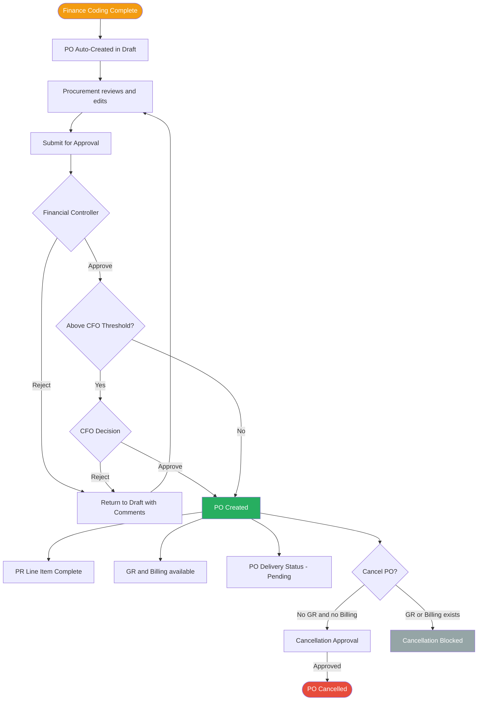

# Feature: PO Creation and Approval

## Module
PO — Purchase Order

## Status
Built — enhancements planned (see below)

## What Is Already Built
- PO creation: Procurement enters SAP PO number manually; system creates PO instantly as Created with no in-system approval step
- Contract, Memo, Online Payment creation: system creates document directly, no approval required — already works correctly, no change needed
- PO content pre-filled from PR: line items and amounts inherited from PR; only document number entered manually
- GR status and Billing status visible on PO page

## What Is Not Yet Built
- PO number auto-generation (currently entered from SAP)
- In-system approval process: Financial Controller + CFO approval before PO reaches Created
- PO cancellation flow

## AS-IS Flow (Current)
Procurement enters SAP PO number into this system → PO is instantly Created → no approval step in this system. Approval was done in SAP prior to receiving the number.

## Overview
When a PR line item is assigned document type "PO" and Finance coding is complete, the system automatically creates a Purchase Order. The PO goes through an approval chain (Financial Controller → CFO if above threshold) before becoming active. This replaces the current manual process of entering a PO number from SAP. PO number format: `PO-{Buddhist Era year}/{5-digit sequence}` e.g. `PO-2569/00001`.

## Solution Description

**PO Auto-Creation**
The system auto-generates a PO in **Draft** status once Finance coding is completed on a PR line item with document type = PO. A unique **PO number is assigned at Draft** — the moment the PO is created. Format: `PO-{BE year}/{5-digit sequence}` (e.g. `PO-2569/00001`). The number never changes through the approval lifecycle.

One PO is created per vendor. If a PR has line items assigned to different vendors, each vendor gets a separate PO.

**PO Content**
The PO is pre-filled from the PR and is editable while in Draft:
- **Vendor** — inherited from price comparison on the PR
- **Line Items** — item name, details, quantity, unit price per item
- **Amount** — total amount per line item and overall PO total

Once the PO reaches **Created**, all content is locked — no further editing is allowed.

**Status Summary** (visible once PO is Created)
- **GR Status** — derived from GR records: Not Started / Partially Received / Fully Received
- **Billing Status** — derived from billing records: Not Started / Partial / Complete
- **PO Delivery Status** — manually updated by Procurement: Pending / Sent (confirms the PO document has been delivered to the vendor)

**Approval Chain**
Procurement reviews and submits the Draft PO for approval manually.

1. **Financial Controller** — approves or rejects the PO
2. **CFO** — approves or rejects; triggered only when PO total exceeds a configured threshold (set by CFO)

Upon full approval, the PO status changes to **Created**.

If rejected at any step, the PO returns to **Draft** with reviewer comments. Procurement can edit and resubmit.

Once the PO status is **Created**, it becomes eligible for Good Receipt (GR) and Billing recording.

The PR line item is marked as having a purchasing document once its associated PO reaches **Created** status. A PR is fully complete when all line items have a purchasing document.

**PO Cancellation**
A Created PO can be cancelled by Procurement only if no GR has been recorded and no Billing has been confirmed against it.
- Procurement initiates cancellation with a mandatory reason
- Requires Financial Controller approval; CFO approval required if PO amount is above the configured threshold
- Once cancelled: GR and Billing become unavailable for this PO; the PR line item returns to open status

## Acceptance Criteria
- **Auto-creation:** System creates a PO in Draft status when Finance coding is complete on a PR line item (type = PO). One PO per vendor — if multiple vendors are assigned across line items, each vendor gets a separate PO.
- **PO number:** A unique PO number is assigned at Draft. The number does not change through the approval lifecycle.
- **Editable in Draft only:** Procurement can edit PO content (line items, amounts) while in Draft. Once Created, all content is locked.
- **Manual submit:** Procurement reviews the Draft PO and manually submits it for approval.
- **Approval routing:** PO must pass Financial Controller approval. CFO approval is required only when PO amount exceeds the configured threshold.
- **Rejection handling:** Rejection returns the PO to Draft with the reviewer's comments. Procurement can edit and resubmit.
- **CFO threshold config:** CFO configures the PO amount threshold that triggers their own approval step. Changing the threshold applies to new POs only.
- **Status progression:** PO status follows strictly: Draft → Pending Approval → Created. No reversal after Created.
- **PR completion:** A PR line item is complete when its PO reaches Created. A PR is complete when all line items have a purchasing document.
- **PO Delivery status:** Procurement can manually mark a Created PO as Sent. Default is Pending.
- **Cancellation:** A Created PO can be cancelled only if no GR has been recorded and no Billing has been confirmed. Cancellation requires Financial Controller approval (and CFO if above threshold). Cancellation reason is mandatory.

## Process Flow
Reference: [po-workflow.md](../../04_diagrams/process-flows/po-workflow.md)

