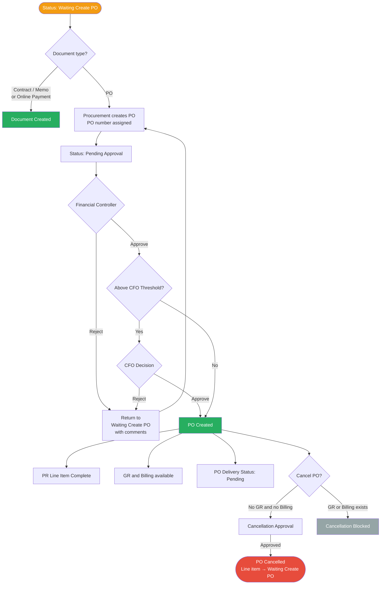

# Feature: PO Creation and Approval

## Module
PO — Purchase Order

## Status
Built — enhancements planned (see Enhancements section)

## Implementation Status

| # | Feature | Status |
|---|---------|--------|
| — | PO creation: SAP PO number entered manually, instantly Created | Built |
| — | PO content pre-filled from PR (line items, amounts) | Built |
| — | Contract, Memo, Online Payment created directly — no approval | Built |
| — | GR status and Billing status visible on PO page | Built |
| E1 | PO number system-generated at creation (replace SAP manual entry) | Pending |
| E2 | In-system approval chain: Financial Controller → CFO | Pending |
| E3 | PO cancellation flow | Pending |

## Overview
When a PR line item reaches "Waiting Create PO" status and the vendor code is confirmed, Procurement manually creates the Purchase Order. The PO goes through an approval chain (Financial Controller → CFO if above threshold) before becoming active. This replaces the current manual process of entering a PO number from SAP. PO number format: `PO-{Buddhist Era year}/{5-digit sequence}` e.g. `PO-2569/00001`.

## Solution Description

**PO Creation**
After Finance Coding is complete, the PR line item enters **Waiting Create PO** status. No PO exists yet at this point.

Before Procurement can create a PO, the vendor code must be confirmed (see PR — E4):
- **Search & Select vendor** — vendor code already confirmed, PO creation available immediately
- **Manual Entry vendor** — Procurement must confirm the vendor code via Tax ID match against vendor master first

Once the vendor code is confirmed, Procurement manually triggers PO creation. The system assigns a unique **PO number at creation**. Format: `PO-{BE year}/{5-digit sequence}` (e.g. `PO-2569/00001`). The number never changes through the approval lifecycle.

One PO is created per vendor. If a PR has line items assigned to different vendors, each vendor gets a separate PO.

**PO Content**
The PO is pre-filled from the PR:
- **Vendor** — inherited and confirmed from the PR vendor confirmation step
- **Line Items** — item name, details, quantity, unit price per item
- **Expected Delivery Date** — pre-populated from PR per line item, read-only
- **Amount** — total amount per line item and overall PO total

All PO content is locked at creation — no editing after the PO is created.

**Status Summary** (visible once PO is Created)
- **GR Status** — derived from GR records: Not Started / Partially Received / Fully Received
- **Billing Status** — derived from billing records: Not Started / Partial / Complete
- **PO Delivery Status** — manually updated by Procurement: Pending / Sent (confirms the PO document has been delivered to the vendor)

**Approval Chain**
Once Procurement creates the PO it immediately enters **Pending Approval** status and is routed for approval.

1. **Financial Controller** — approves or rejects the PO
2. **CFO** — approves or rejects; triggered only when PO total exceeds a configured threshold (set by CFO)

Upon full approval, the PO status changes to **Created**.

If rejected at any step, the PO returns to **Waiting Create PO** with reviewer comments. Procurement can correct and re-create.

Once the PO status is **Created**, it becomes eligible for Good Receipt (GR) and Billing recording.

The PR line item is marked as having a purchasing document once its associated PO reaches **Created** status. A PR is fully complete when all line items have a purchasing document.

**PO Cancellation**
A Created PO can be cancelled by Procurement only if no GR has been recorded and no Billing has been confirmed against it.
- Procurement initiates cancellation with a mandatory reason
- Requires Financial Controller approval; CFO approval required if PO amount is above the configured threshold
- Once cancelled: GR and Billing become unavailable for this PO; the PR line item returns to Waiting Create PO status

## Acceptance Criteria
- **Waiting Create PO:** PR line item sits at Waiting Create PO after Finance Coding is complete. No PO exists at this point.
- **Vendor confirmation gate:** PO creation is blocked until the vendor code is confirmed. Search & Select vendors are already confirmed. Manual Entry vendors must be confirmed via Tax ID match first.
- **Manual creation:** Procurement manually triggers PO creation once the vendor is confirmed. The system does not auto-create a PO.
- **PO number:** A unique PO number is assigned at the moment of creation. Format: `PO-{BE year}/{5-digit sequence}`. The number does not change through the approval lifecycle.
- **Content locked at creation:** PO content (vendor, line items, amounts, delivery dates) is locked the moment the PO is created. No editing after creation.
- **Status progression:** PO status follows strictly: Waiting Create PO → Pending Approval → Created. There is no Draft status.
- **Approval routing:** PO must pass Financial Controller approval. CFO approval is required only when PO amount exceeds the configured threshold.
- **Rejection handling:** Rejection returns the PO to Waiting Create PO status with the reviewer's comments. Procurement can correct and re-create.
- **CFO threshold config:** CFO configures the PO amount threshold that triggers their own approval step. Changing the threshold applies to new POs only.
- **PR completion:** A PR line item is complete when its PO reaches Created. A PR is complete when all line items have a purchasing document.
- **PO Delivery status:** Procurement can manually mark a Created PO as Sent. Default is Pending.
- **Cancellation:** A Created PO can be cancelled only if no GR has been recorded and no Billing has been confirmed. Cancellation requires Financial Controller approval (and CFO if above threshold). Cancellation reason is mandatory. On cancellation, the PR line item returns to Waiting Create PO.

## Process Flow

## Enhancements

### Context
The current flow bypasses this system's approval — Procurement gets a PO number from SAP and enters it manually. E1–E3 replace SAP entirely: system-generated PO number, in-system approval, and a proper cancellation flow.

---

### E1 — PO Number Auto-Generation

**Status:** Pending

Replaces manual SAP PO number entry. The system assigns a unique PO number the moment Procurement creates the PO (after vendor confirmation).

- Format: `PO-{Buddhist Era year}/{5-digit sequence}` e.g. `PO-2569/00001`
- Number assigned at creation — never changes through the approval lifecycle
- Sequence resets each BE year

**Acceptance Criteria:**
- PO number is auto-assigned when Procurement creates the PO. Procurement does not enter it manually.
- Format follows `PO-{BE year}/{5-digit sequence}`.
- Number is unique and does not change through Pending Approval → Created.
- Sequence increments per BE year and resets at year rollover.

---

### E2 — In-System Approval Chain

**Status:** Pending

Replaces SAP approval. Procurement submits the Draft PO for approval within this system.

1. **Financial Controller** — approves or rejects
2. **CFO** — approves or rejects; triggered only when PO total exceeds a threshold configured by the CFO

On full approval the PO status becomes **Created**. On rejection at any step, the PO returns to Draft with reviewer comments and Procurement can edit and resubmit.

**Acceptance Criteria:**
- Procurement manually submits a Draft PO for approval.
- PO must pass Financial Controller approval before any further step.
- CFO approval is triggered only when PO total exceeds the configured threshold.
- Rejection at any step returns the PO to Waiting Create PO with mandatory reviewer comments.
- Procurement can correct and re-create the PO after rejection.
- CFO configures the approval threshold. Changes apply to new POs only.
- Status follows strictly: Waiting Create PO → Pending Approval → Created. There is no Draft status.

---

### E3 — PO Cancellation Flow

**Status:** Pending

Allows Procurement to cancel a Created PO, subject to conditions and approval.

- Cancellation is only available if no GR has been recorded and no Billing has been confirmed against the PO
- Procurement initiates with a mandatory cancellation reason
- Requires Financial Controller approval; CFO approval required if PO amount is above the configured threshold
- Once cancelled: GR and Billing become unavailable for this PO; the associated PR line item returns to open status

**Acceptance Criteria:**
- Cancellation option is only shown when no GR and no confirmed Billing exist against the PO.
- Procurement must enter a cancellation reason before initiating.
- Cancellation requires Financial Controller approval (and CFO if above threshold).
- Once cancelled, GR and Billing are blocked for this PO.
- The PR line item linked to the cancelled PO returns to open status.

---

## Decisions Log
- **SAP replacement** — ✅ PO number generation and approval move fully into this system. SAP is removed from the PO flow.
- **One PO per vendor** — ✅ If a PR has line items across multiple vendors, each vendor gets a separate PO.
- **CFO threshold** — ✅ CFO configures the amount threshold that triggers their own approval. Threshold changes apply to new POs only.

## Open Questions
None outstanding.

## Related Features
- [PR Creation and Approval](../../02_features/PR-Purchase-Request/001-pr-creation-and-approval.md)
- [Good Receipt](../../02_features/GR-Good-Receipt/001-gr-creation.md)
- [Vendor Portal Billing](../../02_features/Billing/002-vendor-portal-billing.md)
