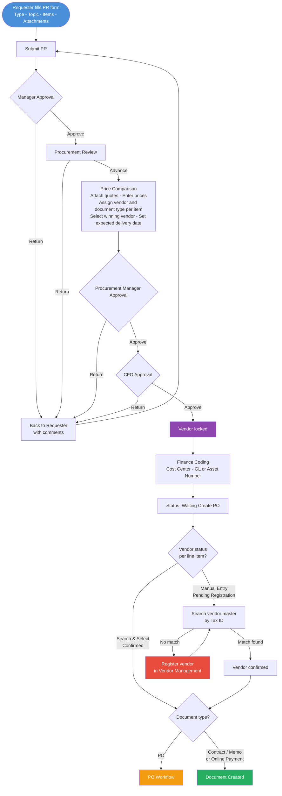

# Feature: PR Creation and Approval

## Module
PR — Purchase Request

## Status
Built — enhancements planned (see Enhancements section)

## Implementation Status

| # | Feature | Status |
|---|---------|--------|
| — | PR form (type, topic, dept, items, attachments) | Built |
| — | Full approval chain (Manager → CFO → Finance Coding) | Built |
| — | Price Comparison: quotes, prices, VAT flag, doc type | Built |
| — | Finance Coding: cost center and GL code (free text) | Built |
| — | Kanban board with SLA flagging | Built |
| — | PR cancellation before manager approval | Built |
| E1 | Entity field on PR form (NTB / NTBX / NTBI / NTBPL) | Pending |
| E2 | Finance Coding: smart search for cost center and GL code | Pending |
| E3 | Vendor locked after CFO approval and read-only on documents | Pending |
| E4 | Vendor code confirmation for Manual Entry vendors | Pending |
| E5 | Expected delivery date per line item | Pending |

## Overview
Requesters create a Purchase Request ticket to initiate a procurement. The PR moves through a defined approval chain — Manager → Procurement Review → Price Comparison → Procurement Manager → CFO → Finance Coding — before becoming ready for PO creation. Each stage has a configurable SLA. Procurement and Finance teams manage all PRs through a Kanban board view.

## Solution Description

**PR Creation**
The requester fills in the PR form with the following information:
- **Entity:** Legal entity that owns this procurement — NTB, NTBX, NTBI, or NTBPL. Defaults to NTB when the form opens. User can change before submitting. This entity is passed to Bookkeeping in all accounting files generated from this PR.
- **PR Type:** HQ (สำนักงานใหญ่), Branch (สาขา), or Construction (ก่อสก้าง)
- **Topic:** Short title of the request
- **Details / Note:** Free-text description
- **Department / Branch:** Department name for HQ, or branch code for branch requests
- **Line Items:** One or more items, each with item name, details, quantity, and estimated price
- **File Attachments:** Supporting documents attached to the PR

One PR has one cost center only — assigned by the Accountant later in the flow.

**Approval Chain**
After submission the PR moves through these stages in order:

1. **Manager Approval** — Approves or returns the whole PR (no partial approval per item). If returned, the requester receives it back with comments and can revise and resubmit.
2. **Procurement Review** — Procurement team reviews completeness. Can return to requester or advance to price comparison.
3. **Price Comparison** — Procurement collects vendor quotations. Each vendor's quote is attached as a file. Procurement manually enters the price amount per item per vendor. No minimum number of vendors required. Different line items can be assigned to different vendors. For each line item, Procurement also selects the **VAT flag** (7% or 0%) based on the vendor's quote — this flag carries through to the PO and billing and is not editable at later stages. Procurement also selects the winning vendor per line item using one of two modes (see Enhancements — Vendor Linkage).
4. **Procurement Manager Approval** — Approves or returns. Cannot edit pricing or vendor selection.
5. **CFO Approval** — Approves or returns. Cannot edit pricing or vendor selection.
6. **Finance Coding** — Any accountant on the team can pick up the PR. They must code all line items before the PR can advance. Two actions are required:
   - **Cost Center** — one per PR. Accountant uses smart search against Bookkeeping master data directly (type to search, live results). Currently free text copy-paste — see E2.
   - **Per line item:** classify as Asset or Expense
     - **Asset** → accountant manually enters the asset number (free text, sourced from SAP — SAP still generates asset numbers)
     - **Expense** → accountant uses smart search to select a GL code from the GL Expense Config master (code + description, e.g., `5210400010 ค่าเช่าตึก`). Currently free text copy-paste — see E2.

   All line items must be coded before advancing. Partial save is not allowed. Once all items are coded, the accountant clicks **Submit** to move the PR forward.

   If the accountant finds an issue with the PR (e.g., unclear item type), they can return it to Procurement with comments. Procurement can then fix or return it further to the requester.

After Finance Coding is submitted, the PR status becomes **Waiting Create PO**.

**Document Type Assignment**
During price comparison, Procurement assigns a document type to each line item:
- **PO** → follows the PO state machine
- **Contract** → document created directly, no PO flow
- **Memo** → document created directly, no PO flow
- **Online Payment** → document created directly, no PO flow

**PO Creation**
- **Current (AS-IS):** Procurement exports PR details from the system, creates PO in SAP, then enters the SAP PO number back into this system
- **To-Be (Enhancement):** After Finance Coding is complete, the system automatically creates a PO with status **Draft** — SAP is removed from the flow. The PO then follows the PO approval process: Draft → Pending Approval → Created

**PR Completion**
A PR is complete when all line items have a purchasing document (PO Created, or Contract / Memo / Online Payment document assigned).

**Cancellation**
A requester can cancel their PR only before the manager approves it. Once approved, cancellation is not allowed.

**Visibility & Board**
- Requester sees only their own PRs
- Procurement, Accounting, and CFO see all PRs on a Kanban board organized by stage
- Board supports filtering by PR type, stage, SLA status, and action required
- Each card shows: PR number, type, topic, requester, estimated amount, item count, and SLA tag

**SLA**
- CFO configures SLA duration per stage
- If a PR has been in a stage longer than the configured SLA, the card is flagged with an "เกิน SLA" tag on the board

## Acceptance Criteria
- **PR form:** All required fields (type, topic, department/branch, at least one line item) must be filled before submission.
- **Approval flow:** PR must pass each stage in order. No stage can be skipped. Approvers can only approve or return — they cannot edit PR content.
- **Return handling:** When returned at any stage, the PR goes back to the requester with the reviewer's comments. Requester can revise and resubmit from the beginning of the chain.
- **Cancellation:** Requester can cancel only while the PR is in "Waiting Manager Approval" state. Once the manager approves, cancellation is locked.
- **Finance Coding:** All line items must be coded before the PR can advance. Partial coding is not allowed. The accountant manually clicks Submit after all items are coded.
- **Entity:** Defaults to NTB when form opens. User can change to NTBX, NTBI, or NTBPL before submitting.
- **Cost center:** One cost center per PR. Smart search directly against Bookkeeping master data. Currently free text — see E2.
- **Asset items:** Accountant manually enters the asset number as free text (sourced from SAP).
- **Expense items:** Accountant uses smart search to select a GL code from GL Expense Config master in this system. Currently free text — see E2.
- **Finance Coding return:** Accountant can return the PR to Procurement with comments if there is an issue. Procurement can then fix or return it further to the requester.
- **Document type:** Each line item must have a document type assigned before the PR can advance past price comparison.
- **Expected delivery date:** Each line item must have an expected delivery date filled in when the winning vendor is selected at Price Comparison. Mandatory — PR cannot advance without it. Editable by Procurement up until PO creation. Locked once the PO is created — pre-populated on the PO as read-only.
- **VAT flag:** Each line item must have a VAT flag selected (7% or 0%) at price comparison. This flag is locked after price comparison and flows to the PO and billing stages unchanged.
- **PR completion:** PR status = Complete only when every line item has a purchasing document.
- **SLA flag:** If a PR exceeds the configured SLA for its current stage, the "เกิน SLA" tag appears on the board card automatically.
- **Visibility:** Requesters see only their own PRs. Procurement, Accounting, and CFO see all PRs on the board.

## Process Flow

## Enhancements

### Context

E1 and E2 complete the PR form and Finance Coding stage. E3–E5 enforce vendor linkage: locked after CFO approval, verified at Waiting Create PO (manual-entry path only), and read-only on all documents. The two vendor input modes at Price Comparison are already built and serve as the foundation for E3 and E4.

---

### E1 — Entity Field on PR Form

**Status:** Pending

Adds a mandatory **Entity** dropdown to the PR creation form (above PR Type). Defaults to NTB. Read-only after submission. The selected entity is carried through to all accounting data sent to Bookkeeping.

| Option | Entity |
|--------|--------|
| NTB | Ngern Turbo Co., Ltd. |
| NTBX | TBC |
| NTBI | TBC |
| NTBPL | TBC |

**Acceptance Criteria:**
- Defaults to NTB. Requester can change before submitting. Mandatory.
- Read-only after submission at all stages.
- Displayed on PR detail and all downstream documents.
- Included in all accounting data sent to Bookkeeping.

---

### E2 — Finance Coding: Smart Search for Cost Center and GL Code

**Status:** Pending

**Background**
This system maintains a **GL Expense Config** master — a local table where each record pairs a GL code (sourced from Bookkeeping) with an expense description meaningful to the Procurement/Accounting team (e.g., `5210400010 — Office Rent`). GL codes are populated from Bookkeeping via sync; the expense description is managed in this system. Finance Coding searches this local master — it does not call Bookkeeping directly.

Replaces free-text entry with live search against the GL Expense Config master for both coding fields at Finance Coding.

- **Cost center** — one per PR. Accountant types to search directly against Bookkeeping master data (live API call). Must select from results — free text not allowed.
- **GL code** — per Expense line item. Accountant searches by code or description (e.g. `5210400010 ค่าเช่าตึก`). Must select from results.
- **Asset number** — unaffected. Remains free text.

Both fields are locked after Finance Coding is submitted.

**Acceptance Criteria:**
- Cost center and GL code fields are live search inputs. Free-text entry is not allowed.
- Cost center searches Bookkeeping master data directly (live API call). Only cost centers present in Bookkeeping can be selected.
- GL code searches the local GL Expense Config master (synced from Bookkeeping). Only codes present in GL Expense Config can be selected.
- Search results show code + description. Accountant can search by either.
- Asset number field is not changed.

---

### E3 — Vendor Locked After CFO Approval and Read-Only on Documents

**Status:** Pending

**Background**
At Price Comparison, Procurement selects the winning vendor per line item using one of two modes — both already built:
- **Search & Select** — vendor exists in master. Code, name, and tax ID pulled from master. No further check needed downstream.
- **Manual Entry** — vendor not yet in master. Procurement types name and tax ID from the quote. Status: **Pending Vendor Registration**. Requires E4 match check before document creation.

**Lock at CFO approval**
Once the CFO approves, all vendor fields per line item are frozen — name, tax ID, and input mode. For Search & Select vendors, the vendor code is also locked. For Manual Entry vendors, the name and tax ID are locked as entered — vendor code is still pending and will be resolved via E4.

To correct a vendor after CFO approval, the PR must be returned to Price Comparison and re-approved.

**Read-only on document creation**
On PO / Contract / Memo / Online Payment creation forms, the vendor field is pre-populated from the confirmed vendor code and is not editable. For Manual Entry vendors, the vendor code must be confirmed via E4 before the PO can be created — this is enforced as a validation check at PO creation.

**Acceptance Criteria:**
- Vendor fields become read-only immediately after CFO approves.
- Lock persists through Finance Coding, Waiting Create PO, and document creation.
- On all document creation forms, vendor is pre-populated and read-only — no edit control is rendered.
- PO creation is blocked if the vendor code is not yet confirmed. Procurement must complete E4 first.
- If a return occurs after CFO approval, vendor fields stay locked unless the PR re-enters Price Comparison.

---

### E4 — Vendor Code Confirmation for Manual Entry Vendors

**Status:** Pending

For Manual Entry vendors, the vendor code must be confirmed against the vendor master before the PO can be created. This is enforced as a validation check at PO creation — Procurement must complete this step first.

**Flow:**
1. Procurement searches the vendor master by tax ID at Waiting Create PO
2. Match on **tax ID only** (name variations are acceptable)
   - **Match found** → vendor code confirmed and stored. Pending Vendor Registration badge removed. PO creation available.
   - **No match** → Procurement registers the vendor in Vendor Management, then searches again.

Search & Select line items skip this step — vendor code is already confirmed.

Once the vendor code is confirmed, it is carried through to the PO and included in accounting transactions sent to Bookkeeping at GR confirmation and Billing approval.

**Acceptance Criteria:**
- PO creation is blocked for Manual Entry line items until the vendor code is confirmed.
- Procurement must search and confirm the vendor code before creating the PO.
- Match is by tax ID only.
- On match: vendor code stored, Pending Vendor Registration badge removed, PO creation available.
- On no match: Procurement registers the vendor in Vendor Management, then searches again.
- Confirmed vendor code is included in accounting transactions sent to Bookkeeping at GR and Billing.

---

### E5 — Expected Delivery Date per Line Item

**Status:** Pending

When Procurement selects the winning vendor for a line item at Price Comparison, an **Expected Delivery Date** field appears and is mandatory. The PR cannot advance past Price Comparison without it.

- One date per line item — different items can have different dates
- Editable by Procurement through Finance Coding and Waiting Create PO
- Locked when the PO is created — pre-populated on the PO as read-only
- Visible on PO detail page and GR recording screen

**Acceptance Criteria:**
- Field appears per line item when a winning vendor is selected. Mandatory before Price Comparison can be submitted.
- Editable after CFO approval, up until PO creation.
- Pre-populated on the PO at creation. Read-only on PO and all stages after.
- Visible on PO detail and GR recording screen.
- Field not shown for line items with no winning vendor selected.

---

## Decisions Log
- **GL Expense Config** — ✅ This system maintains a GL Expense Config master table. GL codes are sourced from Bookkeeping (sync approach TBD); expense descriptions are managed locally in this system. Finance Coding searches this local master — it does not call Bookkeeping directly.
- **Cost center integration** — ✅ Cost center data is sourced from Bookkeeping via integration. Approach (API call, sync, etc.) to be defined with the Bookkeeping team during implementation.

## Open Questions
None outstanding.

## Related Features
- [PO Creation and Approval](../../02_features/PO-Purchase-Order/001-po-creation-and-approval.md)
- [Vendor Portal Billing](../../02_features/Billing/002-vendor-portal-billing.md)
