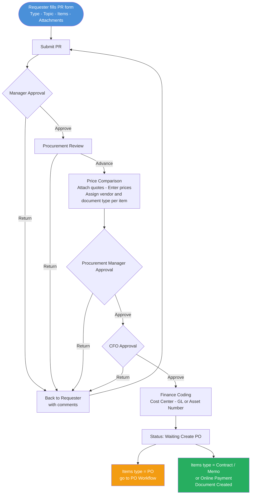

# Feature: PR Creation and Approval

## Module
PR — Purchase Request

## Status
Built — enhancements planned (see Enhancements section)

## What Is Already Built
- PR form: type, topic, department/branch, line items, attachments
- Full approval chain: Manager → Procurement Review → Price Comparison → Procurement Manager → CFO → Finance Coding
- Price Comparison: vendor quote attachments, price entry, VAT flag, document type assignment, vendor free-text or select from master (UI only — no system enforcement)
- Finance Coding: cost center and GL code as free-text copy-paste; asset number as free text
- Kanban board with SLA flagging
- PR cancellation before manager approval

## What Is Not Yet Built
- Entity field on PR form (NTB / NTBX / NTBI / NTBPL)
- Finance Coding: smart search against Bookkeeping master for cost center and GL code (currently free text)
- Vendor linkage enforcement: E2 lock after CFO approval, E3 tax ID match check, E4 read-only vendor on document

## Overview
Requesters create a Purchase Request ticket to initiate a procurement. The PR moves through a defined approval chain — Manager → Procurement Review → Price Comparison → Procurement Manager → CFO → Finance Coding — before becoming ready for PO creation. Each stage has a configurable SLA. Procurement and Finance teams manage all PRs through a Kanban board view.

## Solution Description

**PR Creation**
The requester fills in the PR form with the following information:
- **Entity:** Legal entity that owns this procurement — NTB, NTBX, NTBI, or NTBPL. Defaults to NTB when the form opens. User can change before submitting. This entity is passed to Bookkeeping in all accounting files generated from this PR.
- **PR Type:** HQ (สำนักงานใหญ่), Branch (สาขา), or Construction (ก่อสก้าง)
- **Topic:** Short title of the request
- **Details / Note:** Free-text description
- **Department / Branch:** Department name for HQ, or branch code for branch requests
- **Line Items:** One or more items, each with item name, details, quantity, and estimated price
- **File Attachments:** Supporting documents attached to the PR

One PR has one cost center only — assigned by the Accountant later in the flow.

**Approval Chain**
After submission the PR moves through these stages in order:

1. **Manager Approval** — Approves or returns the whole PR (no partial approval per item). If returned, the requester receives it back with comments and can revise and resubmit.
2. **Procurement Review** — Procurement team reviews completeness. Can return to requester or advance to price comparison.
3. **Price Comparison** — Procurement collects vendor quotations. Each vendor's quote is attached as a file. Procurement manually enters the price amount per item per vendor. No minimum number of vendors required. Different line items can be assigned to different vendors. For each line item, Procurement also selects the **VAT flag** (7% or 0%) based on the vendor's quote — this flag carries through to the PO and billing and is not editable at later stages. Procurement also selects the winning vendor per line item using one of two modes (see Enhancements — Vendor Linkage).
4. **Procurement Manager Approval** — Approves or returns. Cannot edit pricing or vendor selection.
5. **CFO Approval** — Approves or returns. Cannot edit pricing or vendor selection.
6. **Finance Coding** — Any accountant on the team can pick up the PR. They must code all line items before the PR can advance. Two actions are required:
   - **Cost Center** — one per PR. Accountant uses smart search against Bookkeeping master data (type to search, live results). Currently free text copy-paste — smart search is a planned enhancement.
   - **Per line item:** classify as Asset or Expense
     - **Asset** → accountant manually enters the asset number (free text, sourced from SAP — SAP still generates asset numbers)
     - **Expense** → accountant uses smart search to select a GL code from Bookkeeping master data (code + description, e.g., `5210400010 ค่าเช่าตึก`). Currently free text copy-paste — smart search is a planned enhancement.

   All line items must be coded before advancing. Partial save is not allowed. Once all items are coded, the accountant clicks **Submit** to move the PR forward.

   If the accountant finds an issue with the PR (e.g., unclear item type), they can return it to Procurement with comments. Procurement can then fix or return it further to the requester.

After Finance Coding is submitted, the PR status becomes **Waiting Create PO**.

**Document Type Assignment**
During price comparison, Procurement assigns a document type to each line item:
- **PO** → follows the PO state machine
- **Contract** → document created directly, no PO flow
- **Memo** → document created directly, no PO flow
- **Online Payment** → document created directly, no PO flow

**PO Creation**
- **Current (AS-IS):** Procurement exports PR details from the system, creates PO in SAP, then enters the SAP PO number back into this system
- **To-Be (Enhancement):** After Finance Coding is complete, the system automatically creates a PO with status **Draft** — SAP is removed from the flow. The PO then follows the PO approval process: Draft → Pending Approval → Created

**PR Completion**
A PR is complete when all line items have a purchasing document (PO Created, or Contract / Memo / Online Payment document assigned).

**Cancellation**
A requester can cancel their PR only before the manager approves it. Once approved, cancellation is not allowed.

**Visibility & Board**
- Requester sees only their own PRs
- Procurement, Accounting, and CFO see all PRs on a Kanban board organized by stage
- Board supports filtering by PR type, stage, SLA status, and action required
- Each card shows: PR number, type, topic, requester, estimated amount, item count, and SLA tag

**SLA**
- CFO configures SLA duration per stage
- If a PR has been in a stage longer than the configured SLA, the card is flagged with an "เกิน SLA" tag on the board

## Acceptance Criteria
- **PR form:** All required fields (type, topic, department/branch, at least one line item) must be filled before submission.
- **Approval flow:** PR must pass each stage in order. No stage can be skipped. Approvers can only approve or return — they cannot edit PR content.
- **Return handling:** When returned at any stage, the PR goes back to the requester with the reviewer's comments. Requester can revise and resubmit from the beginning of the chain.
- **Cancellation:** Requester can cancel only while the PR is in "Waiting Manager Approval" state. Once the manager approves, cancellation is locked.
- **Finance Coding:** All line items must be coded before the PR can advance. Partial coding is not allowed. The accountant manually clicks Submit after all items are coded.
- **Entity:** Defaults to NTB when form opens. User can change to NTBX, NTBI, or NTBPL before submitting.
- **Cost center:** One cost center per PR. Smart search against Bookkeeping master data. Enhancement — currently free text.
- **Asset items:** Accountant manually enters the asset number as free text (sourced from SAP).
- **Expense items:** Accountant uses smart search to select a GL code from Bookkeeping master data. Enhancement — currently free text.
- **Finance Coding return:** Accountant can return the PR to Procurement with comments if there is an issue. Procurement can then fix or return it further to the requester.
- **Document type:** Each line item must have a document type assigned before the PR can advance past price comparison.
- **VAT flag:** Each line item must have a VAT flag selected (7% or 0%) at price comparison. This flag is locked after price comparison and flows to the PO and billing stages unchanged.
- **PR completion:** PR status = Complete only when every line item has a purchasing document.
- **SLA flag:** If a PR exceeds the configured SLA for its current stage, the "เกิน SLA" tag appears on the board card automatically.
- **Visibility:** Requesters see only their own PRs. Procurement, Accounting, and CFO see all PRs on the board.

## Process Flow

## Enhancements

### Vendor Linkage at Price Comparison and Document Creation

**Background:** Vendor Management and PR operate as separate modules. The linkage point is when Procurement selects the winning vendor per line item during Price Comparison. The winning vendor is locked after CFO approval — no substitution is allowed at document creation.

**Enhancement list:**

- [ ] **E1 — Two vendor input modes at Price Comparison** *(UI already supports both modes — enforcement is the gap)*
  At Price Comparison, Procurement selects the winning vendor per line item using one of two modes:
  - **Search & Select** — vendor exists in vendor master. Procurement searches by name or tax ID and selects. The vendor code and tax ID are locked immediately. No further vendor check is needed at document creation.
  - **Manual Entry** — vendor is not yet in vendor master. Procurement enters vendor name and tax ID from the quote. These are recorded as unconfirmed and flagged as "Pending Vendor Registration."

- [ ] **E2 — Vendor identity locked after CFO approval**
  Once CFO approves, the winning vendor per line item (whether selected from master or manually entered) is frozen. Procurement cannot change the vendor at any later stage. This applies to vendor code, tax ID, and name.

- [ ] **E3 — Vendor match check at Waiting Create PO (manual entry path only)**
  If the winning vendor was entered manually at Price Comparison, the system requires a vendor master search before the document can be created:
  - Procurement searches vendor master by tax ID
  - System matches on **tax ID only** (name is display only — variations are acceptable)
  - If match found → vendor code confirmed → Procurement can create PO / Contract / Memo / Online Payment
  - If no match → Procurement must register the vendor in Vendor Management first, then search again
  - If the vendor was selected from master at Price Comparison → this step is skipped entirely, document creation is available immediately

- [ ] **E4 — Vendor field on document is read-only**
  On PO / Contract / Memo / Online Payment creation, the vendor field is pre-populated from the confirmed vendor code and is not editable. Procurement cannot substitute a different vendor at this stage.

---

## Open Questions
- [ ] **GL code master list config** — how does the Accounting team manage the GL code list in the system? (add / edit / deactivate codes). Needs a config screen design.
- [ ] **Cost center integration** — the cost center dropdown is sourced from Bookkeeping's master data. Integration approach (API call, sync, etc.) to be defined with the Bookkeeping team.

## Backlog
- **Notifications:** Notify the task owner when a PR moves to their stage (e.g. notify manager when PR is waiting for their approval). Channel TBD — email / in-app. Added to backlog.

## Related Features
- [PO Creation and Approval](../../02_features/PO-Purchase-Order/001-po-creation-and-approval.md)
- [Vendor Portal Billing](../../02_features/Billing/002-vendor-portal-billing.md)
