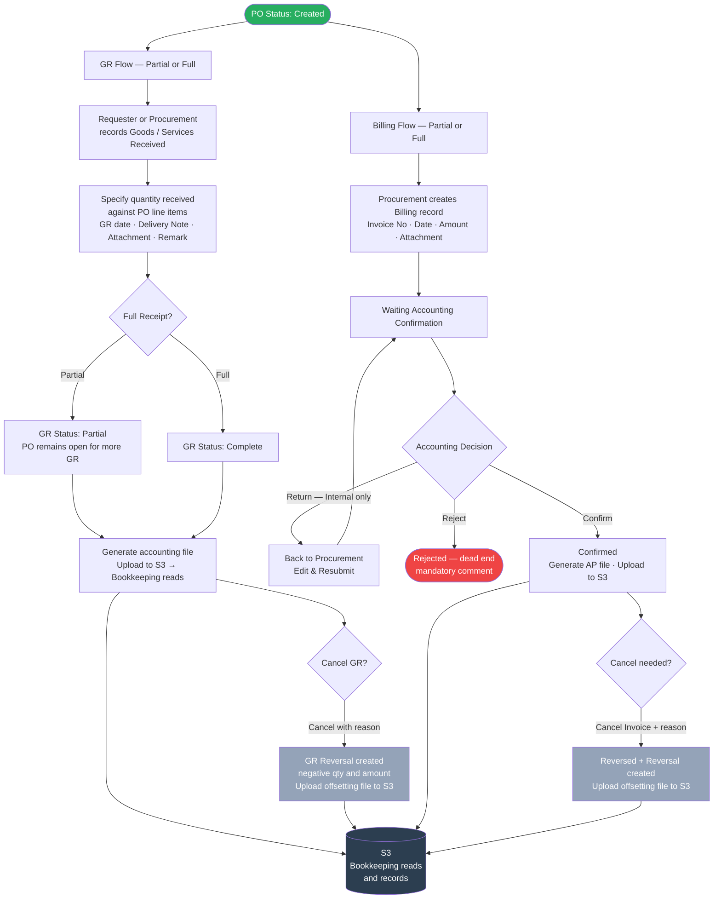

# GR & Billing Overview Diagram

## Triggered after PO Status = Created

### AS-IS (Current State)
- **GR:** Recorded inside PO page by Requester or Procurement. Fields: quantity, GR date, remark, attachment. No cancellation mechanism. No Bookkeeping posting.
- **Billing:** Recorded inside PO page by Procurement. Fields: invoice date, amount, attachment, remark. No invoice number. Accounting has no visibility in the system — all communication is manual via email. No Bookkeeping posting.

### To-Be (Target State — diagram below)

## Key Design Points
- GR and Billing are **both linked to the same PO**
- Each can be done multiple times (partial) until fully completed
- GR and Billing are **independent** — billing does not require GR to be complete
- **GR actor is Requester or Procurement** — not Warehouse
- **GR posts to Bookkeeping via S3 file** — no Accounting confirmation step required
- **Billing requires Accounting confirmation** before posting to Bookkeeping via S3 file
- Both GR and Billing reversals generate offsetting S3 files to zero out the original entry
- S3 file format and payload: **TBD with Bookkeeping team**

## Billing Statuses (Queue)
| Status | Description |
|---|---|
| Waiting Accounting Confirmation | Active — awaiting Accounting action |
| Rejected | Permanent dead end — no resubmission |

## Billing Statuses (Billing List)
| Status | Description |
|---|---|
| Confirmed | AP file posted to Bookkeeping via S3 |
| Reversed | Original invoice — cancelled, offset by Reversal record |
| Reversal | Counter-entry that zeroes out the Reversed AP entry |

## GR Statuses
| Entity | Possible States |
|---|---|
| GR Record | Confirmed / Reversed / Reversal |
| PO GR Status | Not Started → Partial → Complete |
| PO Billing Status | Not Started → Partial → Complete |
