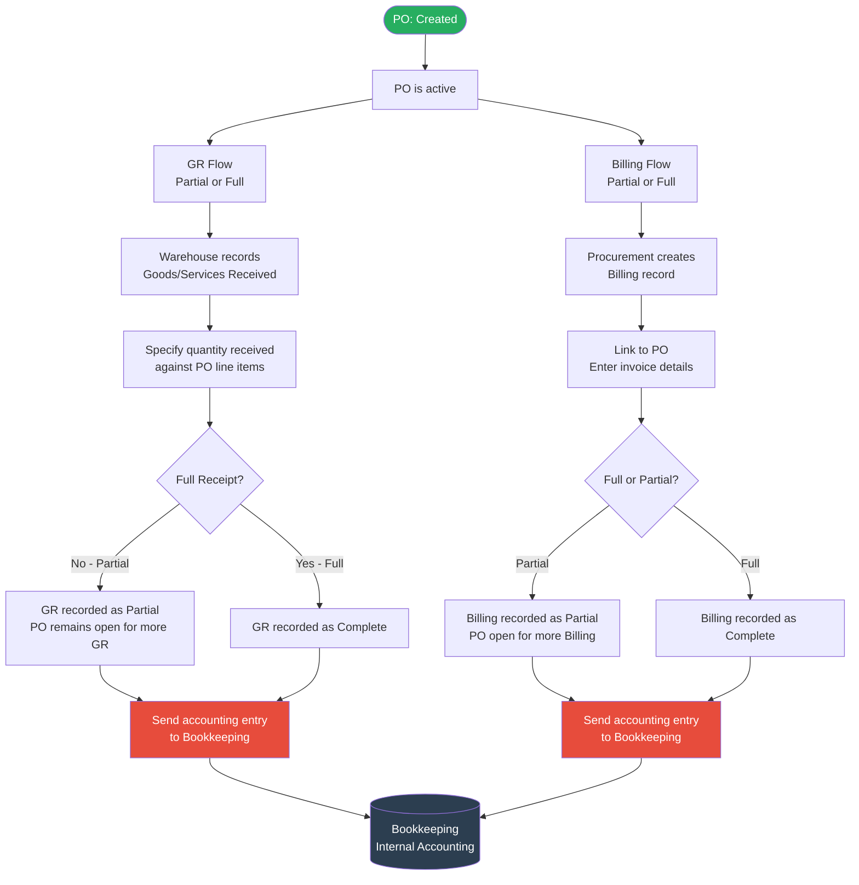

# GR & Billing Overview Diagram

## Triggered after PO Status = Created

## Key Design Points
- GR and Billing are **both linked to the same PO**
- Each can be done multiple times (partial) until fully completed
- GR and Billing are **independent** — you can bill without GR and vice versa (exact rules TBD)
- Every GR and Billing action triggers an **accounting transaction to Bookkeeping**
- Transaction payload structure: **TBD with Bookkeeping team**

## States (Draft — to be detailed in feature spec)
| Entity | Possible States |
|---|---|
| GR | Pending → Partial / Complete |
| Billing | Pending → Partial / Complete |
