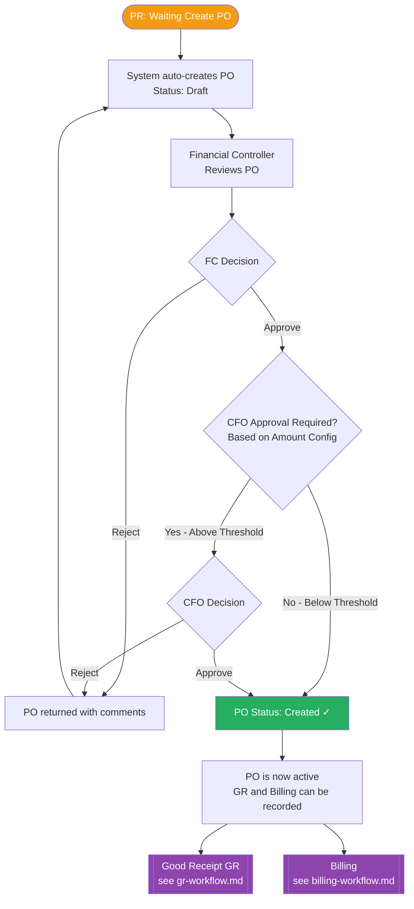

# PO Workflow Diagram

## PO is created from a PR line item where Document Type = PO

## PO States
| State | Description |
|---|---|
| Draft | PO auto-generated from approved PR line; awaiting submission for approval |
| Pending Approval | Submitted to Financial Controller (and CFO if above threshold) |
| Created | Fully approved — GR and Billing can now be recorded against this PO |

## Business Rules
- PO is auto-created from PR lines where document type = PO after Finance coding is complete
- CFO approval step is **configurable** — triggered only when PO amount exceeds the configured threshold
- Rejection at any step returns the PO to Draft with comments
- Once **Created**, GR and Billing are independent — they do not change the PO status
- PO status does **not** depend on GR or Billing completion
