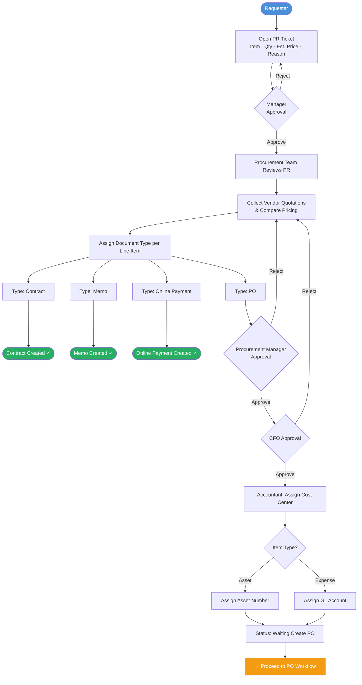

# PR Workflow Diagram

## Status: Enhancement Phase (Core built, refining)

## PR States
| State | Description |
|---|---|
| Draft | Requester is filling in the PR |
| Pending Manager Approval | Submitted, awaiting manager |
| Pending Procurement Review | Manager approved, procurement reviewing |
| Pending Procurement Manager Approval | Quotes compared, awaiting Procurement Manager |
| Pending CFO Approval | Awaiting CFO sign-off |
| Pending Finance Coding | Awaiting Accountant cost center / GL / asset assignment |
| Waiting Create PO | Finance coding complete — PO lines ready to process |
| Complete | All line items have a purchasing document |
| Rejected | Rejected at any approval step |
| Cancelled | Cancelled by requester before completion |
