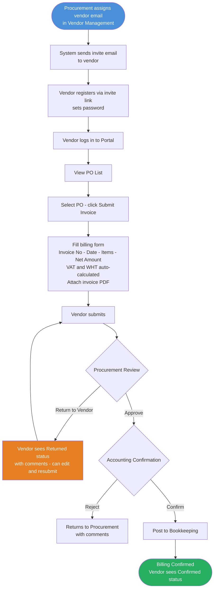

# Diagram: Vendor Portal Billing Flow

```mermaid
flowchart TD
    A([Procurement assigns vendor email\nin Vendor Management]) --> B[System sends invite email\nto vendor]
    B --> C[Vendor registers via invite link\nsets password]
    C --> D[Vendor logs in to Portal]

    D --> E[View PO List]
    E --> F[Select PO - click Submit Invoice]
    F --> G[Fill billing form\nInvoice No - Date - Items - Net Amount\nVAT and WHT auto-calculated\nAttach invoice PDF]
    G --> H[Vendor submits]

    H --> I{Procurement Review}
    I -->|Return to Vendor| J[Vendor sees Returned status\nwith comments - can edit and resubmit]
    J --> H
    I -->|Approve| K{Accounting Confirmation}
    K -->|Reject| L[Returns to Procurement\nwith comments]
    K -->|Confirm| M[Post to Bookkeeping]
    M --> N([Billing Confirmed\nVendor sees Confirmed status])

    style A fill:#4A90D9,color:#fff
    style N fill:#27AE60,color:#fff
    style J fill:#E67E22,color:#fff
```
