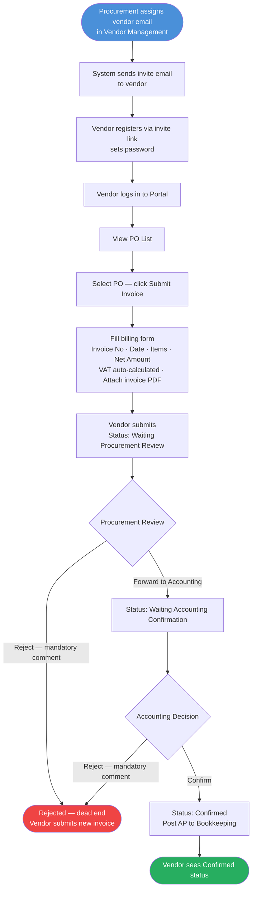

# Diagram: Vendor Portal Billing Flow (Phase 2)

## Notes
- **Return to vendor is not supported in Phase 1.** Incorrect submissions are rejected — vendor submits a new invoice.
- Vendor-facing statuses: Waiting Review · Waiting Confirmation · Confirmed · Rejected
- Internal statuses mirror Phase 1 billing: Waiting Procurement Review → Waiting Accounting Confirmation → Confirmed / Rejected
